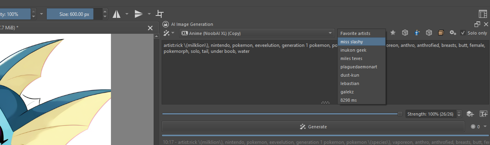

# Random Artists and Tags Fork



This fork adds functionality for randomly selecting artists and tags:
- Random artists button that pulls from:
  - e621_artist_webui.csv
  - danbooru_artist_webui.csv
- Random tags button that fetches tags from random posts on either site
- Customizable settings menu with:
  - Categories list for filtering
  - Unwanted tags exclusion list

## Installation

Install the required dependencies by running:

```powershell
python -m pip install beautifulsoup4 requests curl_cffi --target="C:\Program Files\Krita (x64)\lib\site-packages"
```

And move the cffi_backend dependency that comes with the project to the correct location:

```powershell
mv "$env:USERPROFILE\AppData\Roaming\krita\pykrita\ai_diffusion\_cffi_backend.cp310-win_amd64.pyd" "C:\Program Files\Krita (x64)\lib\krita-python-libs"
```

If you don't trust the package I suggest you to try installing it yourself manually by installing it from pip. I couldn't manage to do that myself though lol

**Note:** You may need administrator privileges to run these commands.
