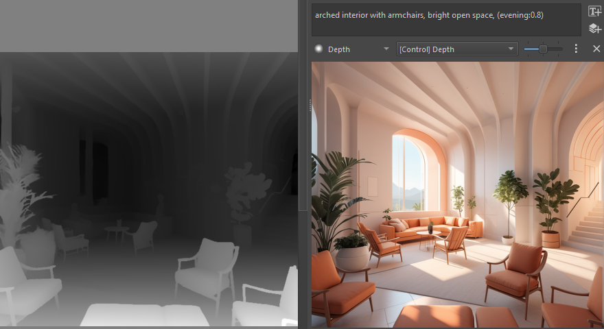

<h1> Generative AI <i>for Krita</i></h1>

✨[Features](#features) | ⭳ [Download](https://github.com/Acly/krita-ai-diffusion/releases/latest) | 🛠️[Installation](https://docs.interstice.cloud/installation) | 🎞️ [Video](https://youtu.be/Ly6USRwTHe0) | 🖼️[Gallery](#gallery) | 📖[User Guide](https://docs.interstice.cloud) | 💬[Discussion](https://github.com/Acly/krita-ai-diffusion/discussions) | 🗣️[Discord](https://discord.gg/pWyzHfHHhU)

This is a plugin to use generative AI in image painting and editing workflows
from within Krita. Visit
[**www.interstice.cloud**](https://www.interstice.cloud) for an introduction. Learn how to install and use it on [**docs.interstice.cloud**](https://docs.interstice.cloud).

The main goals of this project are:
* **Precision and Control.** Creating entire images from text can be unpredictable.
  To get the result you envision, you can restrict generation to selections,
  refine existing content with a variable degree of strength, focus text on image
  regions, and guide generation with reference images, sketches, line art,
  depth maps, and more.
* **Workflow Integration.** Most image generation tools focus heavily on AI parameters.
  This project aims to be an unobtrusive tool that integrates and synergizes
  with image editing workflows in Krita. Draw, paint, edit and generate seamlessly without worrying about resolution and technical details.
* **Local, Open, Free.** We are committed to open source models. Customize presets, bring your
  own models, and run everything local on your hardware. Cloud generation is also available
  to get started quickly without heavy investment.  

##  Features

* **Inpainting**: Use selections for generative fill, expand, to add or remove objects
* **Live Painting**: Let AI interpret your canvas in real time for immediate feedback. [Watch Video](https://youtu.be/AF2VyqSApjA?si=Ve5uQJWcNOATtABU)
* **Upscaling**: Upscale and enrich images to 4k, 8k and beyond without running out of memory.
* **Diffusion Models**: Supports Stable Diffusion 1.5, and XL. Partial support for [Flux](https://github.com/Acly/krita-ai-diffusion/discussions/1176) and SD3.
* **ControlNet**: Scribble, Line art, Canny edge, Pose, Depth, Normals, Segmentation, +more
* **IP-Adapter**: Reference images, Style and composition transfer, Face swap
* **Regions**: Assign individual text descriptions to image areas defined by layers.
* **Job Queue**: Queue and cancel generation jobs while working on your image.
* **History**: Preview results and browse previous generations and prompts at any time.
* **Strong Defaults**: Versatile default style presets allow for a streamlined UI.
* **Customization**: Create your own presets - custom checkpoints, LoRA, samplers and more.

##  Getting Started

See the [Plugin Installation Guide](https://docs.interstice.cloud/installation) for instructions.

A concise (more technical) version is below:

### Requirements

* Windows, Linux, MacOS
* _On Linux/Mac:_ Python + venv must be installed
    * recommended version: 3.12 or 3.11
    * usually available via package manager, eg. `apt install python3-venv`

#### Hardware support

To run locally a powerful graphics card with at least 6 GB VRAM (NVIDIA) is
recommended. Otherwise generating images will take very long or may fail due to
insufficient memory!

<table>
<tr><td>NVIDIA GPU</td><td>supported via CUDA (Windows/Linux)</td></tr>
<tr><td>AMD GPU</td><td>DirectML (Windows, limited features, 12+ GB VRAM recommended) ROCm (Linux, via custom ComfyUI)</td></tr>
<tr><td>Apple Silicon</td><td>community support, MPS on macOS 14+</td></tr>
<tr><td>CPU</td><td>supported, but very slow</td></tr>
</table>

### Installation

1. If you haven't yet, go and install [Krita](https://krita.org/)! _Required version: 5.2.0 or newer_
1. [Download the plugin](https://github.com/Acly/krita-ai-diffusion/releases/latest).
2. Start Krita and install the plugin via Tools ▸ Scripts ▸ Import Python Plugin from File...
    * Point it to the ZIP archive you downloaded in the previous step.
    * ⚠ _This will delete any previous install of the plugin._ If you are updating from 1.14 or older please read [updating to a new version](https://docs.interstice.cloud/common-issues#update-plugin).
    * Check [Krita's official documentation](https://docs.krita.org/en/user_manual/python_scripting/install_custom_python_plugin.html) for more options.
3. Restart Krita and create a new document or open an existing image.
4. To show the plugin docker: Settings ‣ Dockers ‣ AI Image Generation.
5. In the plugin docker, click "Configure" to start local server installation or connect.

> [!NOTE]
> If you encounter problems please check the [FAQ / list of common issues](https://docs.interstice.cloud/common-issues) for solutions.
>
> Reach out via [discussions](https://github.com/Acly/krita-ai-diffusion/discussions), our [Discord](https://discord.gg/pWyzHfHHhU), or report [an issue here](https://github.com/Acly/krita-ai-diffusion/issues). Please note that official Krita channels are **not** the right place to seek help with
> issues related to this extension!

### _Optional:_ Custom ComfyUI Server

The plugin uses [ComfyUI](https://github.com/comfyanonymous/ComfyUI) as backend.
As an alternative to the automatic installation, you can install it manually or
use an existing installation. If the server is already running locally before
starting Krita, the plugin will automatically try to connect. Using a remote
server is also possible this way.

Please check the list of [required extensions and models](https://docs.interstice.cloud/comfyui-setup) to make sure your installation is compatible.

### _Optional:_ Object selection tools (Segmentation)

If you're looking for a way to easily select objects in the image, there is a [separate plugin](https://github.com/Acly/krita-ai-tools) which adds AI segmentation tools.

## Contributing

Contributions are very welcome! Check the [contributing guide](CONTRIBUTING.md) to get started.

##  Gallery

_Live painting with regions (Click for video)_

_Inpainting on a photo using a realistic model_

_Reworking and adding content to an AI generated image_

_Adding detail and iteratively refining small parts of the image_

_Modifying the pose vector layer to control character stances (Click for video)_

_Control layers: Scribble, Line art, Depth map, Pose_

## Technology

* Image generation: [Stable Diffusion](https://github.com/Stability-AI/generative-models), [Flux](https://blackforestlabs.ai/)
* Diffusion backend: [ComfyUI](https://github.com/comfyanonymous/ComfyUI)
* Inpainting: [ControlNet](https://github.com/lllyasviel/ControlNet), [IP-Adapter](https://github.com/tencent-ailab/IP-Adapter)