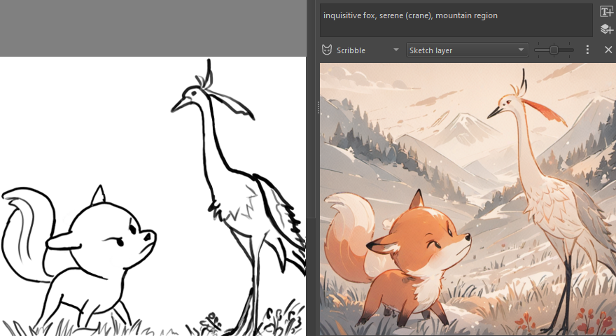
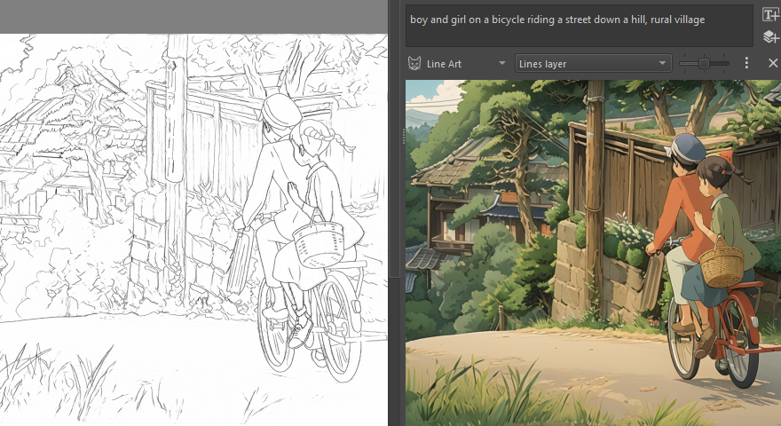
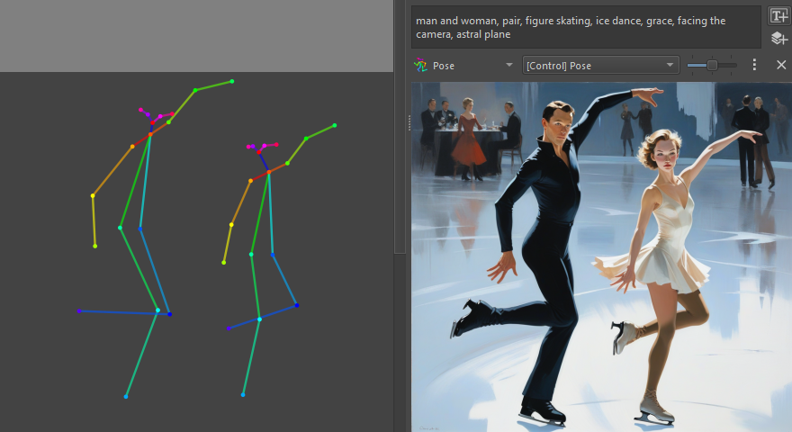

 Üretken AI <i>için Krita</i>

✨[Özellikler](#features) | ⭳ [İndir](https://github.com/Acly/krita-ai-diffusion/releases/latest) | 🛠️[Kurulum](https://docs.interstice.cloud/installation) | 🎞️ [Video](https://youtu.be/Ly6USRwTHe0) | 🖼️[Galeri](#gallery) | 📖[Kullanıcı Kılavuzu](https://docs.interstice.cloud) | 💬[Tartışma](https://github.com/Acly/krita-ai-diffusion/discussions) | 🗣️[Discord](https://discord.gg/pWyzHfHHhU)

Bu, Krita içinde görüntü boyama ve düzenleme iş akışlarında üretken AI kullanmak için bir eklentidir. Bir tanıtım için [**www.interstice.cloud**](https://www.interstice.cloud) adresini ziyaret edin. Kurulum ve kullanımını öğrenmek için [**docs.interstice.cloud**](https://docs.interstice.cloud) adresine bakın.

Bu projenin ana hedefleri:
* **Hassasiyet ve Kontrol.** Metinden tam görüntüler oluşturmak tahmin edilemez olabilir. Hayal ettiğiniz sonucu elde etmek için üretimi seçimlere kısıtlayabilir, mevcut içeriği değişken derecede güçle geliştirebilir, metni görüntü bölgelerine odaklayabilir ve referans görüntüleri, eskizler, çizgi sanatı, derinlik haritaları ve daha fazlasıyla üretimi yönlendirebilirsiniz.
* **İş Akışı Entegrasyonu.** Çoğu görüntü üretme aracı AI parametrelerine yoğunlaşır. Bu proje, Krita'daki görüntü düzenleme iş akışlarıyla entegre olan ve sinerji yaratan, göze batmayan bir araç olmayı hedefler. Çizim yapın, boyayın, düzenleyin ve çözünürlük ve teknik detaylar hakkında endişelenmeden sorunsuz bir şekilde üretin.
* **Yerel, Açık, Ücretsiz.** Açık kaynak modellerine bağlıyız. Ön ayarları özelleştirin, kendi modellerinizi getirin ve her şeyi donanımınızda yerel olarak çalıştırın. Ağır yatırım yapmadan hızlı başlamak için bulut üretimi de mevcuttur.

##  Özellikler

* **İç Boyama**: Nesneleri eklemek veya kaldırmak için seçimleri kullanarak üretken doldurma, genişletme yapın.
* **Canlı Boyama**: AI'nin tuvalinizi gerçek zamanlı yorumlamasına izin verin, anında geri bildirim için. [Videoyu İzle](https://youtu.be/AF2VyqSApjA?si=Ve5uQJWcNOATtABU)
* **Yükseltme**: Görüntüleri 4k, 8k ve ötesine yükseltin ve zenginleştirin, bellek tükenmeden.
* **Difüzyon Modelleri**: Stable Diffusion 1.5, XL, Illustrious ve Flux modellerini destekler.
* **Düzenleme Modelleri**: Talimat tabanlı görüntü düzenleme için Flux Kontext'i destekler.
* **ControlNet**: Karalama, Çizgi sanatı, Canny kenar, Poz, Derinlik, Normaller, Segmentasyon ve +daha fazlası.
* **IP-Adapter**: Referans görüntüleri, Stil ve kompozisyon transferi, Yüz değiştirme.
* **Bölgeler**: Katmanlarla tanımlanan görüntü alanlarına bireysel metin açıklamaları atayın.
* **İş Kuyruğu**: Görüntünüz üzerinde çalışırken üretim işlerini sıraya koyun ve iptal edin.
* **Geçmiş**: Sonuçları önizleyin ve önceki üretimleri ve istemleri herhangi bir zamanda göz atın.
* **Güçlü Varsayılanlar**: Çok yönlü varsayılan stil ön ayarları, akıcı bir kullanıcı arayüzüne izin verir.
* **Özelleştirme**: Kendi ön ayarlarınızı oluşturun - özel kontrol noktaları, LoRA, örnekleyiciler ve daha fazlası.

##  Başlarken

Talimatlar için [Eklenti Kurulum Kılavuzu](https://docs.interstice.cloud/installation)'na bakın.

Aşağıda kısa (daha teknik) bir versiyonu var:

### İşletim Sistemi

Windows, Linux, MacOS

#### Donanım Desteği

Yerel olarak çalıştırmak için en az 6 GB VRAM'li güçlü bir grafik kartı (NVIDIA) önerilir. Aksi takdirde görüntü üretimi çok uzun sürer veya yetersiz bellek nedeniyle başarısız olabilir!

<table>
<tr><td>NVIDIA GPU</td><td>CUDA aracılığıyla desteklenir (Windows/Linux)</td></tr>
<tr><td>AMD GPU</td><td>DirectML (Windows, sınırlı özellikler, 12+ GB VRAM önerilir) ROCm (Linux, özel ComfyUI aracılığıyla)</td></tr>
<tr><td>Apple Silicon</td><td>topluluk desteği, macOS 14+ üzerinde MPS</td></tr>
<tr><td>CPU</td><td>desteklenir, ancak çok yavaş</td></tr>
<tr><td>XPU</td><td>desteklenir, performans sorunları görülebilir (Windows/Linux)</td></tr>
</table>

### Kurulum

1. Henüz yapmadıysanız, [Krita](https://krita.org/)'yı indirin ve kurun! _Gerekli sürüm: 5.2.0 veya daha yeni_
1. [Eklentiyi indirin](https://github.com/Acly/krita-ai-diffusion/releases/latest).
2. Krita'yı başlatın ve eklentiyi Araçlar ▸ Komutlar ▸ Python Eklentisini Dosyadan İçe Aktar... yoluyla kurun.
    * Önceki adımda indirdiğiniz ZIP arşivini işaret edin.
    * ⚠ _Bu, eklentinin önceki kurulumunu siler._ 1.14 veya daha eskiden güncelliyorsanız lütfen [yeni sürüme güncelleme](https://docs.interstice.cloud/common-issues#update-plugin) okuyun.
    * Daha fazla seçenek için [Krita'nın resmi belgelerine](https://docs.krita.org/en/user_manual/python_scripting/install_custom_python_plugin.html) bakın.
3. Krita'yı yeniden başlatın ve yeni bir belge oluşturun veya mevcut bir görüntüyü açın.
4. Eklenti docker'ını göstermek için: Ayarlar ‣ Docker'lar ‣ AI Görüntü Üretimi.
5. Eklenti docker'ında, yerel sunucu kurulumunu başlatmak veya bağlanmak için "Yapılandır"ı tıklayın.

> [!NOTE]
> Sorunlarla karşılaşırsanız lütfen çözümler için [SSS / yaygın sorunlar listesi](https://docs.interstice.cloud/common-issues)'ne bakın.
>
> [Tartışmalar](https://github.com/Acly/krita-ai-diffusion/discussions), [Discord](https://discord.gg/pWyzHfHHhU) veya [burada bir sorun bildirin](https://github.com/Acly/krita-ai-diffusion/issues) aracılığıyla ulaşın. Lütfen resmi Krita kanallarının bu uzantıyla ilgili sorunlar için doğru yer olmadığını unutmayın!

### _İsteğe Bağlı:_ Özel ComfyUI Sunucusu

Eklenti, arka uç olarak [ComfyUI](https://github.com/comfyanonymous/ComfyUI)'yi kullanır. Otomatik kurulumun alternatifi olarak, manuel olarak kurabilir veya mevcut bir kurulum kullanabilirsiniz. Sunucu Krita'yı başlatmadan önce yerel olarak çalışıyorsa, eklenti otomatik olarak bağlanmayı dener. Uzak bir sunucu kullanmak da bu şekilde mümkündür.

Lütfen kurulumunuzun uyumlu olduğundan emin olmak için [gerekli uzantılar ve modeller listesi](https://docs.interstice.cloud/comfyui-setup)'ni kontrol edin.

### _İsteğe Bağlı:_ Nesne Seçimi Araçları (Segmentasyon)

Görüntüdeki nesneleri kolayca seçmek için bir yol arıyorsanız, AI segmentasyon araçları ekleyen [ayrı bir eklenti](https://github.com/Acly/krita-ai-tools) var.

## Katkıda Bulunma

Katkılar çok hoş karşılanır! Başlamak için [katkı kılavuzu](CONTRIBUTING.md)'na bakın.

##  Galeri

_Canlı boyama bölgelerle (Videoyu izlemek için tıklayın)_

_Bir fotoğraf üzerinde iç boyama, gerçekçi bir model kullanarak_

_AI üretilmiş bir görüntüyü yeniden işleme ve içerik ekleme_

_Görüntünün küçük kısımlarına detay ekleme ve yinelemeli olarak geliştirme_

_Karakter duruşlarını kontrol etmek için poz vektör katmanını değiştirme (Videoyu izlemek için tıklayın)_

_Kontrol katmanları: Karalama, Çizgi sanatı, Derinlik haritası, Poz_

## Teknoloji

* Görüntü üretimi: [Stable Diffusion](https://github.com/Stability-AI/generative-models), [Flux](https://blackforestlabs.ai/)
* Difüzyon arka ucu: [ComfyUI](https://github.com/comfyanonymous/ComfyUI)
* İç Boyama: [ControlNet](https://github.com/lllyasviel/ControlNet), [IP-Adapter](https://github.com/tencent-ailab/IP-Adapter)
