# Guide: Rent a Cloud GPU

This is a step-by-step guide on how to run the Stable Diffusion server remotely on cloud services like [runpod.io](https://www.runpod.io) or [vast.ai](https://vast.ai). This allows you to use the plugin without installing a server on your local machine, and is a great option if you don't own a powerful GPU. There is no subscription, you typically pay around 0.25$/hour.

## runpod.io

[runpod.io](https://www.runpod.io) is fairly stream-lined, but offers limited information about download speeds, and is a bit more pricey.

### Step 1: Sign up and add funds

Go to [runpod.io](https://www.runpod.io) and create an account. Go to "Billing" and add funds (one-time payment, minimum 10$, card required).

### Step 2: Select a GPU

I choose community cloud and select 1x RTX 3080. It's cheap and fast! Click _Deploy_.

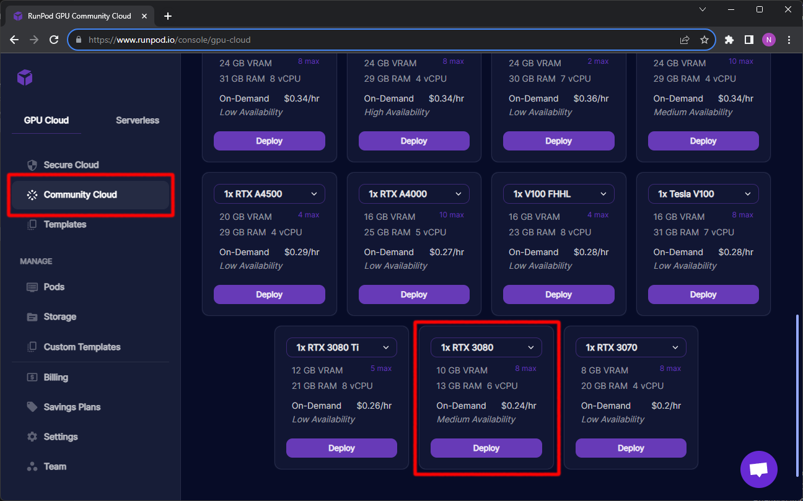

You are free to choose one of the other options of course.

### Step 3: Select the template

Runpod supports all kinds of workloads. To run a server for the Krita plugin, select "Stable Diffusion ComfyUI for Krita". Just typing "krita" into the search bar should find it. Click _Continue_.

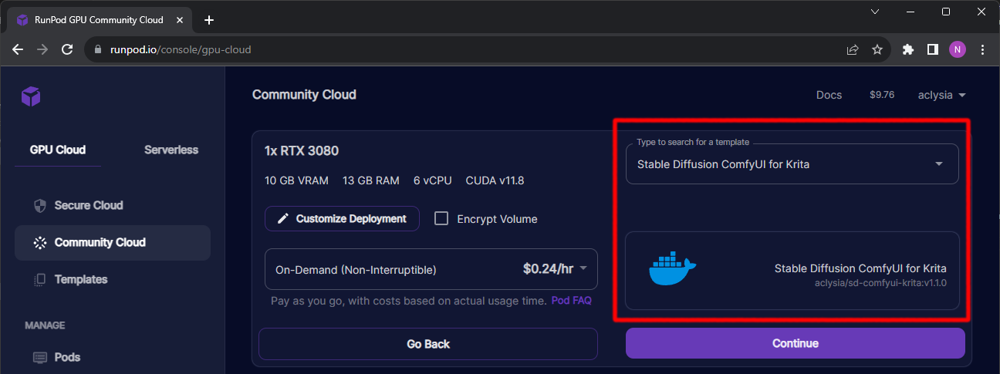

### Step 4: Deploy!

You will get a cost summary. Click _Deploy_.

Now you have to wait until the server is up. This can take a while (~10 minutes) depending on the download speed of your pod. Eventually it should look like this:

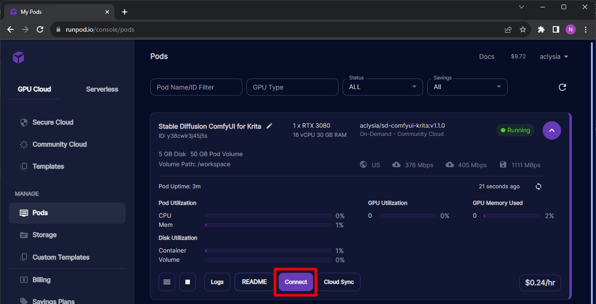

### Step 5: Connect

Once your pod is running, click _Connect_ and choose "HTTP Service [Port 3001]".

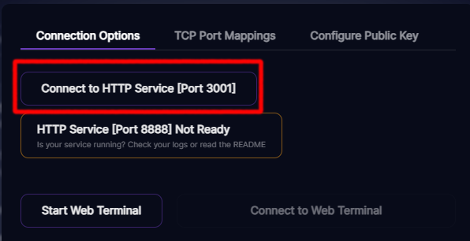

This should open ComfyUI running in your browser. Now simply copy the URL into the Krita plugin and connect!

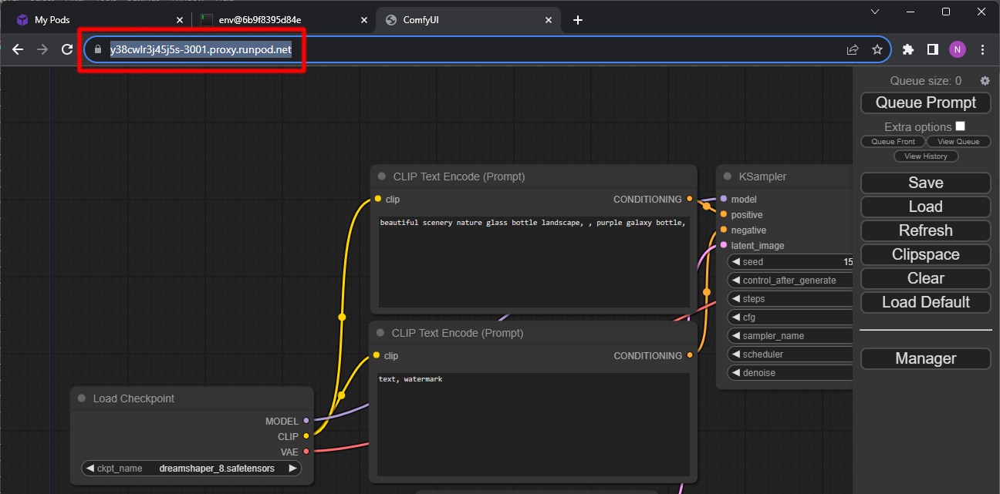

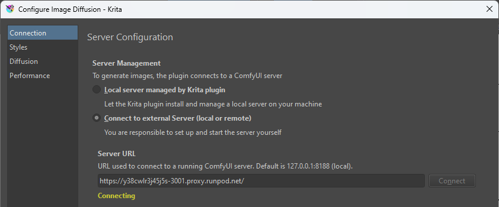

### Afterwards

After you're done using the pod, remember to stop it. You can keep it inactive to potentially reuse it later, but it's not free. To avoid charges, make sure to discard/delete the pod.


## vast.ai

[vast.ai](https://vast.ai) has a very similar offering. You get more details about the machine you will run on, but it also requires you to filter the available pods to get what you want. Minimum initial funds is 5$.

The UI is very similar to runpod.io and so are the steps to set it up.

### Template

You can use [this template](https://cloud.vast.ai/?ref_id=87451&creator_id=87451&name=Stable%20Diffusion%20ComfyUI%20for%20Krita). Try to select a pod in your region with good internet connection. Click _Rent_.

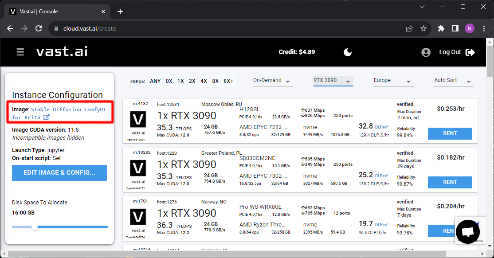

### Connecting

Once your instance has finished loading and is running, click the button which displays the port range to find the URL to connect.

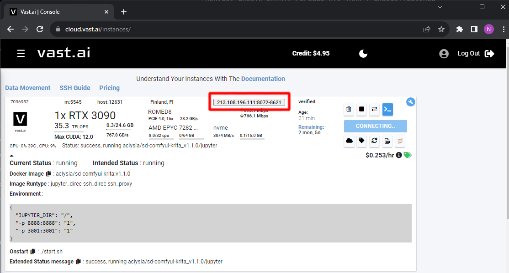

The URL will be the one which maps to port 3001. Copy it into Krita and connect. _Make sure it doesn't contain any spaces!_

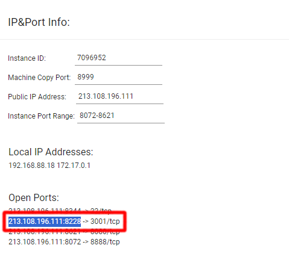

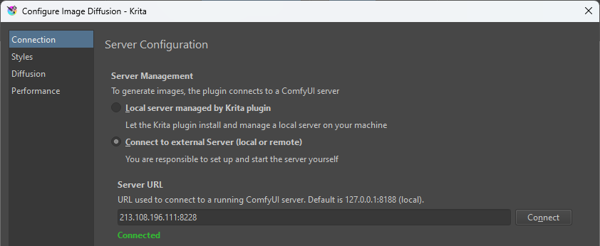


## Custom checkpoints and LoRA

If you want to use custom models you will have to download them to the pod. There is no UI for this yet, but it can be done via SSH terminal.

Either use the web terminal, or connect via ssh.
* Download Checkpoints to `/models/checkpoints`
* Download LoRA to `/models/lora`

```
cd /models/checkpoints
wget --content-disposition 'http://file-you-want-to-download'
```

After download is complete, click the refresh button in Krita and they should show up.

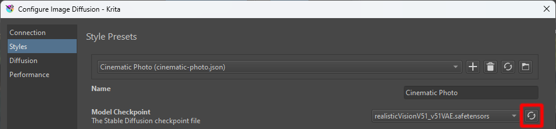
