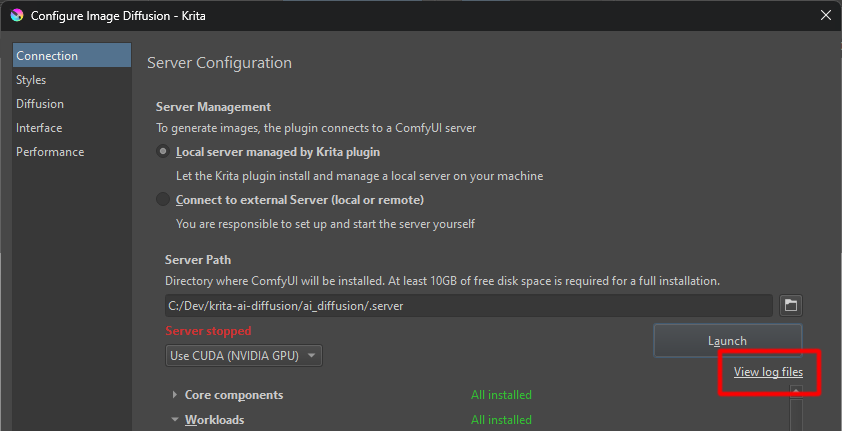

This document collects some common issues and potential solutions. 

> [!IMPORTANT]  
> Before you report a problem on GitHub:
> * make sure it cannot be resolved by one of the solutions proposed here
> * use the search to find existing issues related to your problem
> * gather relevant information such as OS, Krita and Plugin versions, GPU, log files

You can [create a new Issue here](https://github.com/Acly/krita-ai-diffusion/issues).

### Overview

- [Installation](#installation)
  - [Plugin is grayed out in Python Plugins Manager](#plugin-is-grayed-out-in-python-plugins-manager)
  - [How do I update to a new version of the Plugin?](#how-do-i-update-to-a-new-version-of-the-plugin)
  - [How do I relocate my server installation?](#how-do-i-relocate-my-server-installation)
  - [How do I uninstall the Plugin?](#how-do-i-uninstall-the-plugin)
  - [How do I perform a clean re-install of the Plugin?](#how-do-i-perform-a-clean-re-install-of-the-plugin)
  - [How to share models from another folder with Krita AI Diffusion plugin?](#how-to-share-models-from-another-folder-with-krita-ai-diffusion-plugin)
- [Operating System and Hardware](#operating-system-and-hardware)
  - [Supported platforms](#supported-platforms)
  - [Image generation is (really) slow](#image-generation-is-really-slow)
- [Custom ComfyUI](#custom-comfyui)
  - [Error: The following ComfyUI custom nodes are missing](#error-the-following-comfyui-custom-nodes-are-missing)
  - [Error: Could not find Upscale/CLIPVision/IP-Adapter model](#error-could-not-find-upscaleclipvisionip-adapter-model)
  - [This is a SD 1.5/XL checkpoint, but the SD 1.5/XL workload has not been installed](#this-is-a-sd-15xl-checkpoint-but-the-sd-15xl-workload-has-not-been-installed)
  - [Error: LCM LoRA model not found](#error-lcm-lora-model-not-found)

### Log files
If you encounter an issue, it can help to check the log files. They are in the `.logs` folder inside the plugin installation folder. You can also locate the folder with the "View log files" link in the plugin's connection settings. Please attach logs when you open an Issue on GitHub!

## Installation

### Plugin is grayed out in Python Plugins Manager
The most common reason is that a source package was used for installation (eg using GitHub's Code ‣ Download ZIP). It is automatically generated by GitHub and does not contain everything. Please try with a [release package](https://github.com/Acly/krita-ai-diffusion/releases).

Krita will show an error message when you hover over the grayed out entry in the plugin manager. See below for an example. *Please make sure to include the error message if you report an issue!*

### How do I update to a new version of the Plugin?

To upgrade a previous version of the plugin, download and extract the same way as when installing initially. Overwrite and replace existing files when prompted.

Krita has to be restarted for the update to take effect. If your server installation is managed by the plugin, it may prompt you to do an upgrade. This will automatically reinstall the server software, but without downloading models again.

### How do I relocate my server installation?

By default the installer will place the ComfyUI server in `.server` inside your plugin folder. On some platforms this folder may be invisible (enable show invisible files to see it). The path can be chose freely in the UI and point to any other folder. If you already have an installation it's also possible to simply move the folder to a different location.

### How do I uninstall the Plugin?

Simply delete the plugin folder `ai_diffusion` and the `ai_diffusion.desktop` file.

By default no files or data is created outside this folder, unless you specifally choose
a different server path. In that case you can simply delete that folder too.

### How do I perform a clean re-install of the Plugin?

To delete _everything_, follow [uninstall](#how-do-i-uninstall-the-plugin) above.

If you want to keep settings, styles, or the server installation, delete everything inside the `ai_diffusion` folder **except**:
- `.logs`
- `.server`
- `styles`
- `settings.json`

On some platforms folders starting with `.` might be hidden - enable showing invisible files in your file browser to see them.

### How to share models from another folder with Krita AI Diffusion plugin?
If you used the plugin to install and set up ComfyUI, but already have Stable Diffusion models in a different location, it is possible to share them:
1. Go to the folder where you installed the server ("Server Path")
1. Go into the `ComfyUI` folder
1. Rename the file `extra_model_paths.yaml.example` to `extra_model_paths.yaml`
1. Open the file in a text editor and point to the locations where your models are stored

## Operating System and Hardware

### Supported platforms

Krita and the AI Diffusion plugin itself work on Windows, Linux and MacOS with all common hardware. But to run diffusion locally
a powerful GPU and sufficient CPU/RAM are also required. The plugin relies on ComfyUI, which supports a growing number of platforms.
**Unfortunately not all platforms are equally well supported.**

NVIDIA GPUs have by far the highest investment, and are therefore the most reliabe. All other hardware (AMD, Intel, Apple) often does not perform as well
or occasionally breaks. Support relies on many other projects, often maintained by volunteers, and also the hardware vendors themselves.

> [!IMPORTANT]
> Krita AI Diffusion plugin is continually tested on Windows and Linux with NVIDIA GPUs. Other operating systems and hardware may be supported,
> but their support relies on contributions from users of these platforms.

If you encounter server errors reported by ComfyUI on such systems we cannot always reproduce them, and you will likely find more help
by eg. searching the internet for "ComfyUI + your os/gpu".

### Image generation is (really) slow

If you consider generation too slow, here are a few things to check:
* What resolution is your canvas? Start with a low resolution (eg. 512x512) and go up from there.
* Are you using SD 1.5 or SD XL? Note that SD XL uses a minimum resolution of 1024 and requires more resources.
* Are you running out of VRAM? There are tools to track GPU memory usage. If it hits your limit, you may not get an error, but extremely long generation times instead.
* What is your hardware? What is the expected performance for Stable Diffusion? You can find comparisons for many GPUs online.
* What kind of performance do you get when using ComfyUI directly?
  * With Krita and the plugin running, go to http://127.0.0.1:8188 in your browser and "Queue Prompt".
  * If performance is bad there, the problem is not related to the Krita plugin.

## Custom ComfyUI

If you choose to manage your own ComfyUI installation rather than using the built-in installer, keep in mind that you are responsible for getting it running,
installing the plugin's prerequisites as needed, and keeping it up to date. ComfyUI is a fast-moving project with a huge number of extensions and potential for customization.
As a result you may also sometimes encounter problem and conflicts that need to be resolved.

> [!IMPORTANT]
> Please understand that we cannot give tech support for individual ComfyUI installations out there.
> Don't open an Issue here if the problem is not related to the Krita plugin.

A lot of related issues can be resolved by carefully following the [requirements](comfy-requirements.md) and its troubleshooting section.

### Error: The following ComfyUI custom nodes are missing
Make sure you installed the nodes listed in the [requirements](comfy-requirements.md). In case a custom node package is reported to be missing even though you installed it,
please check that ComfyUI startup console output lists them as loaded, and does not report errors. Also make sure the nodes can be created in Comfy's web UI!

### Error: Could not find Upscale/CLIPVision/IP-Adapter model
Make sure you placed the models listed in the [requirements](comfy-requirements.md) in the specified folders. If models are still reported missing, first check if
ComfyUI can find them. Open its web UI and create the respective loader nodes ("Load Upscale Model", "Load CLIP Vision", "Load IPAdapter Model"). If they are not
listed there they are in the wrong folder or there is an issue with your search paths.

### This is a SD 1.5/XL checkpoint, but the SD 1.5/XL workload has not been installed
Workloads refer to the files listed in the [requirements](comfy-requirements.md) in the section "Required models ‣ SD 1.5" (respectively SD XL). Because you can use the plugin with
either SD 1.5 or SD XL, it is not an error if one of them is missing - but you can only use those checkpoints for which you have _all_ the prerequisites.

### Error: LCM LoRA model not found
Make sure you downloaded **and renamed** the file as described in [requirements](comfy-requirements.md). Create a "Load Lora" node in Comfy's web UI and check if the file
is listed there. If it cannot find it it's in the wrong folder or there is an issue with your search paths.
