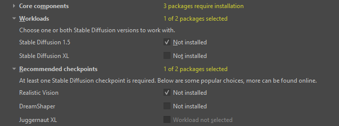
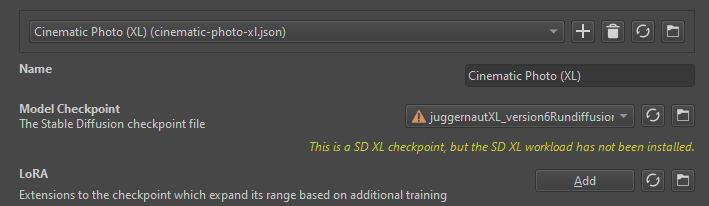

import { Aside } from '@astrojs/starlight/components'
import ExternalLink from '../../components/ExternalLink.astro'

The Krita AI Diffusion plugin works with various different model architectures,
also known as base models. These models are refined, extended and supported by
various other models (LoRA, ControlNet, IP-Adapter) which must match the base
architecture. **Extensions between different base models are not compatible!**

You can install multiple base models with their extensions side by side.
The plugin supports:
* [Stable Diffusion 1.5 (SD1.5)](#stable-diffusion-1.5)
* [Stable Diffusion XL (SDXL)](#stable-diffusion-xl)
* [Illustrious / NoobAI](#illustrious--noobai)

The following base models have limited support:
* <ExternalLink href="https://github.com/Acly/krita-ai-diffusion/discussions/1176">Flux</ExternalLink>
* <ExternalLink href="https://github.com/Acly/krita-ai-diffusion/discussions/1328">Stable Diffusion 3.5 (SD3.5)</ExternalLink>

### Stable Diffusion 1.5

Released in October 2022 this is the older of the two base models. It was
trained on 512x512 images originally, although custom checkpoints also work well
for resolutions up to 768. It is still suitable for much higher resolutions by
generating a low resolution image first and then upscaling it - the Plugin will
do this automatically.

Advantages of SD 1.5:
* Requires less GPU memory (VRAM)
* Requires less disk space
* More community content available (checkpoints, LoRA)
* Wider range of control modes available

### Stable Diffusion XL

Released in July 2023 this is a newer base model designed for higher fidelity.
It was trained on images with a total of 1024x1024 pixels (various aspect
ratios).

Advantages of SD XL:
* Better quality at high resolutions
* Improved understanding of text prompts

### Illustrious / NoobAI

A line of anime-focused models. They are based on the SDXL
architecture but have been trained on a different dataset. This makes them
largely incompatible with extensions and LoRA from "regular" SDXL models.
Instead they are supported by their own set of extensions.

The [base NoobAI XL model](https://civitai.com/models/833294/noobai-xl-nai-xl)
is very versatile within its domain, but not straight-forward to use. It is
recommended to follow its tag-based prompt structure. There are also derivative
models which are easier to use but typically more restricted to a particular style.

<Aside type="tip">
Enabling tag auto-completion in Interface settings helps with writing keywords
that are recognized by the model.
</Aside>
<Aside type="caution">
For _epsilon-prediction_ models the base model has to be set to "Illustrious" manually
in Style settings ▸ Advanced checkpoint configuration. That's because they cannot be
distinguished from SDXL models.

The _v-prediction_ models are also supported. They are detected automatically.
</Aside>

## Installation

When using the Plugin's automatic installer you can select which base model
("workload") you want to install. This will install a minimal set of models
which the plugin needs to perform certain common tasks. Base models which
don't have a workload listed don't need one.

Optional packages and extensions listed below are available for selection
depending on whether the base workload is installed. Some packages like
upscalers are unrelated to diffusion and work for both, others have separate
packages available for each version. Not all extensions exist for all base models.

## Styles

Styles indicate which base model version they use with an icon. This is derived
from the selected checkpoint. Any LoRA you add must match the base model.

Note that the Plugin automatically filters styles for workloads you don't have
installed. In the Style configuration menu you will see a notification if there
is an issue.

