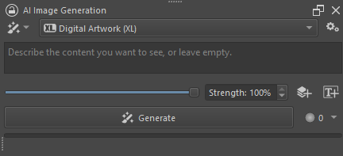
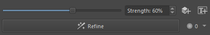

import { Aside } from '@astrojs/starlight/components'
import ExternalLink from '../../components/ExternalLink.astro'
import PluginIcon from '../../components/PluginIcon.astro'

This guide assumes you've completed [installation](/installation). It covers a basic
introduction to the main UI and some best practices.

## Image generation

After creating a new document, the AI image generation docker should look
something like this:

The first thing to do is to enter some text in the text input (prompt) field and
click <PluginIcon name="generate" text="Generate" /> (Shift + Enter). This will ignore
any existing content in your canvas and generate a new image of the same size.

<Aside type="tip">
Images will take longer to generate if the canvas size (width/height) is large.
You may want to start with a small resolution to experiment.
[More about resolutions](#large-resolutions)
</Aside>

### Applying results

After the image is generated, it is displayed on the canvas _as a preview_.
It is common to generate multiple images for the same input and select the one
that fits best. Results are added to the generation history, where you can
quickly select and compare them.

To apply one of the results, click its <PluginIcon name="apply" text="Apply" /> button,
or double-click the thumbnail. This will add the generated result as a new layer
on top of the layer stack, and remove the preview. You can apply as many results
as you want in order to [keep parts or mix them](#generate-erase).

<Aside type="note">
Having to apply results might feel unintuitive at first, but generally ends up
more efficient than explicitly discarding all unwanted results.
</Aside>

### Strength

The strength slider controls how much of the canvas content is used in image
generation. Note how choosing a value that is less than 100% will change the
generate action to <PluginIcon name="refine" text="Refine" />, also known as _image-to-image_.
Instead of generating a new image from scratch, the AI model will use the current
canvas content as a starting point. Lower strength means less alteration of the
existing content.

[Read more about Refinement below.](#refinement)

<Aside type="tip">
If you want to refine a previously generated image, make sure to _apply it first_!
Otherwise you might end up refining a blank canvas and get mostly white results.
</Aside>

### Selections

Creating a selection on the canvas will restrict image generation to the selected
area. Note how the generate action changes to <PluginIcon name="inpaint-fill" text="Fill" />
when strength is at 100%. This is also known as _inpainting_. In addition to Fill the
dropdown allows you to choose various other actions that influence how surrounding content
affects the selected area to be generated. [Read more about selection inpainting.](/selections)

Selections also work with strength at less than 100%, where the generated
masked image will always be some variation of the existing content.

<Aside type="tip">
You can create selections with any of Krita's selection tools. If you are looking for
tools that segment objects, check out the 
<ExternalLink href="https://github.com/Acly/krita-ai-tools">Krita AI Tools plugin</ExternalLink>.
</Aside>

### Control

One of the biggest challenges when working with image generation is to get it to
do what you want. Text prompts are great when you have a vague general idea and
don't care much about the specifics. But when you have a certain composition or style
in mind, controling generation through _images_ is far more intuitive and precise.

This is what control layers are for. You can create them with the 
<PluginIcon name="control-add" text="Add control layer" /> button. [Read more about Control Layers.](/control-layers)

## Workspaces

Plugin workspaces can be changed with the toggle button in the top left of the
docker. Each is fitted for a specific task.

### Upscale

Here you have access to super-resolution models. They increase image size while
keeping sharp outlines. Compared to diffusion models they deliver predictable
and deterministic results without straying too much from the input.

Choose a model and the desired scaling factor. Clicking Upscale
will first resize the canvas to the target resolution, then add the generated
image as a new layer once it is ready.

Checking the "Refine upscaled image" option will additionally run the selected
diffusion model. Instead of processing the entire image at once, it will be
split into tiles which are generated one after the other. This can significantly
improve quality, but may also introduce unwanted changes. Use the "Image guidance"
option to keep the output closer to the original.

<Aside type="note">
Diffusion on large resolutions becomes extremely slow and memory-intensive. By processing
the image in a tiled fashion, 4k and higher resolutions become manageable.
</Aside>

### Live

Live mode is focused on real-time interaction. Quality is traded for speed by default.
The UI is simplified to show a preview of the generated image, which updates as you
paint or change parameters. Press the <PluginIcon name="play" text="Play"/> button to start
live generation.

The _seed_ is what usually gives you multiple different results for the same inputs.
In live mode it is kept constant, so the image only changes when your input does.
Modify the seed to get a different variation of the result.

### Custom Graph

This workspace acts as an extension point to ComfyUI. Users familiar with the
node graph interface can create custom workflows and automate tasks. Running
them directly from Krita allows you to exchange canvas, layer and selection
content with ComfyUI.

You can also build custom UI for parametrization! [Read more about Custom Graphs.](/custom-graph)

### Animation

The animation workspace supports batch operations on keyframes of specific
layers. This allows to transform a series of hand-drawn images in one go.

There is no support for animation models or generating in-between frames at the
moment.

## Best practices

### Refinement

Refinement (_image-to-image_) is one of the most important concepts when working
with AI in Krita. It allows to reliably converge to a desired result by 
incrementally improving regions of the canvas. Strength can be lowered the closer
you get to a final image, and to avoid changing hand-drawn content.

Strength values in the range of 30% to 70% are typically most useful, but this
depends on various factors and requires some experimentation. Common
uses for refinement are:
* Adding texture, shading and detail to areas in the image
* Removing artifacts or unwanted content while keeping colors and structure
* Style transfer (including making images more realistic or cartoonish)

### Generate & Erase

Results are applied as new layers by default. This makes it easy to erase parts
of the image that don't look good, cover something important, or don't blend well
with the surroundings. Use a soft brush to improve transitions between generated
fill content.

If there are multiple results with parts you like, try applying them all and
erasing the parts you don't want. It's a quick way to mix and match different
images.

With selection fill, you may notice that generated content extends beyond the
selection area somewhat. This results in a smoother transition. The idea is that
if you generate a little too much, it is easy to erase. On the other hand, if
the fill area is too small, it's difficult to recreate it at a larger size (the
size and shape changes the result). This behavior can be modified by adjusting
the "Grow" and "Feather" sliders in Diffusion settings.

### Large resolutions

Diffusion models tend to run into performance and memory issues when processing
large images. There are however good reasons to use a high resolution canvas:
* Editing a high resolution photo
* Painting significant parts of the image by hand
* Generating more subjects or at higher detail

The plugin's philosophy is that you shouldn't have to compromise on quality
of your drawing/painting/photos for the sake of image generation. It
will automatically crop and resize images to fit technical requirements and
keep generation times reasonable. [Read more on what it does and how to configure it](/resolutions).