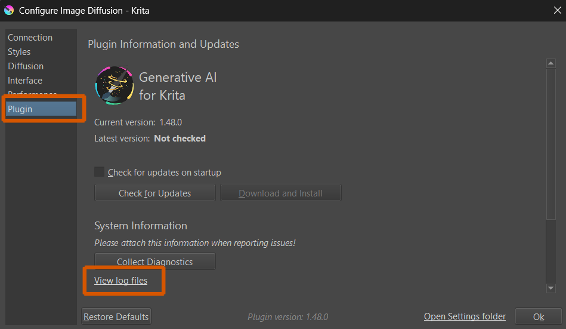
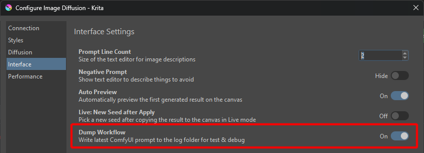
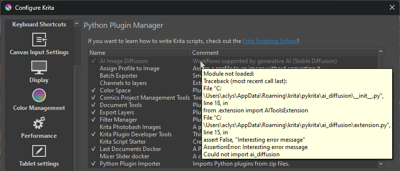

import { Aside } from '@astrojs/starlight/components'
import ExternalLink from '../../components/ExternalLink.astro'

This document collects some common issues and potential solutions. 

<Aside type="note">
Before you report a problem on GitHub:
* make sure it cannot be resolved by one of the solutions proposed here
* use the <ExternalLink href="https://github.com/Acly/krita-ai-diffusion/issues?q=is%3Aissue">search</ExternalLink> to
  find existing issues related to your problem
* gather relevant information such as OS, Krita and Plugin versions, GPU, Log
  files (see below)
</Aside>

You can <ExternalLink href="https://github.com/Acly/krita-ai-diffusion/issues">create a new Issue here</ExternalLink>
or ask questions in <ExternalLink href="https://github.com/Acly/krita-ai-diffusion/discussions">Discussions</ExternalLink>
or on <ExternalLink href="https://discord.gg/pWyzHfHHhU">Discord</ExternalLink>.

_Please note that official Krita channels are **not** the right place to seek
help with issues related to this extension!_

### Log files
If you encounter an issue, it can help to check the log files. You can locate
the folder with the "View log files" link in the plugin's connection settings.
Please attach logs when you open an Issue on GitHub!



### ComfyUI Workflow export
Sometimes it can be helpful to inspect the workflow generated by the plugin in
Comfy's web UI. You can enable workflow export in the Interface settings. The
exported `workflow.json` of the last image generation can be found in the same
folder as the logs.




## Installation

Issues related to installation and update of the plugin and its managed server.

<details>
<summary id="plugin-grayed-out">Plugin is grayed out in Python Plugins Manager</summary>
<p>
The most common reason is that a source package was used for installation (eg
using GitHub's Code ‣ Download ZIP). It is automatically generated by GitHub and
does not contain everything. Please try with a <ExternalLink href="https://github.com/Acly/krita-ai-diffusion/releases">release package</ExternalLink>.

Krita will show an error message when you hover over the grayed out entry in the
plugin manager. See below for an example. *Please make sure to include the error
message if you report an issue!*


</p>
</details>

<details>
<summary id="update-plugin">How do I update to a new version of the Plugin?</summary>
<p>
To upgrade a previous version of the plugin, simply follow the instructions for
initial installation. The old version will be replaced.

Krita has to be restarted for the update to take effect. If your server
installation is managed by the plugin, it may prompt you to do an upgrade. This
will automatically reinstall the server software, but without downloading models
again.

<Aside type="caution">
`Import Python Plugin from File...` deletes the previous version and replaces
it! If you originally installed a version before 1.15.0, your server
installation and settings may be located in the plugin folder. In that case
either
* Extract the plugin manually into the installation folder
  (`.../pykrita/ai_diffusion`). Overwrite existing files when prompted.
* Or relocate your server installation first (you can move the folder and update
  the path in the UI)
</Aside>
</p>
</details>

<details>
<summary id="file-locations">Where are plugin and user files located?</summary>
<p>
The plugin stores data in up to three locations:
1. `<appdata>/krita/pykrita/ai_diffusion` - This is the folder where you installed.
2. `<appdata>/krita/ai_diffusion` - This folder contains user data (settings, styles, logs...)
3. The server location if you installed it via the plugin. By default it is in the same place as user data (2.) unless you changed it manually.

The full path depends on OS and how Krita was installed. You can find it via the ["View log files" link](#log-files) in the plugin's connection settings. Typical paths are:
* Windows: `C:\User\<your-name>\AppData\Roaming\krita\...`
* Linux: `~/.local/share/krita/...`
* MacOS: `~/Library/Application Support/krita/...`
</p>
</details>

<details>
<summary id="relocate-server">How do I relocate my server installation?</summary>
<p>
By default the installer will place the ComfyUI server in
`<appdata>/krita/ai_diffusion/server`. The path can be chosen freely in the UI
and point to any other folder! If you already have an installation it's also
possible to simply move the folder to a different location, and then change the
path in the UI afterwards.
</p>
</details>

<details>
<summary id="uninstall-plugin">How do I uninstall the Plugin?</summary>
<p>
You can remove the plugin simply by deleting the folder where you installed it.

If you installed the server via the plugin, find it at the path you chose for
installation. Delete that folder if you have no further use for it.

See [plugin file locations](#file-locations) for default locations.
</p>
</details>

<details>
<summary id="reinstall-plugin">How do I perform a clean re-install of the Plugin?</summary>
<p>
Follow the installation instructions, it will delete and replace the previous
version.

If you want to re-install the server, you can do this from the Connection settings.
Choose `Manage` > `Re-install`. This will keep your models and settings, but
re-download the server software and update it to the latest version.
</p>
</details>

<details>
<summary id="share-models">How to share models from another folder with Krita AI Diffusion plugin?</summary>
<p>
If you used the plugin to install and set up ComfyUI, but already have Stable
Diffusion models in a different location, it is possible to share them:
1. Go to the folder where you installed the server ("Server Path")
1. Go into the `ComfyUI` folder
1. Open the file `extra_model_paths.yaml` in a text editor and change the paths
   to point to the locations where your models are stored
</p>
</details>

<details>
<summary id="server-arguments">How do I pass additional arguments to ComfyUI?</summary>
<p>
Some issues with certain hardware can be solved by passing additional arguments
to the ComfyUI server. If you used the plugin installer, it will start/stop the
server for you. To add arguments: 
1. Locate `settings.json` in the [user data folder](#file-locations) (`<appdata>/krita/ai_diffusion`)
1. Open it with a text editor (notepad will do)
1. Find the line with `"server_arguments"` and edit the value

For example if you want to add `--force-fp16` and `--dont-upcast-attention`
arguments it should look like this:
```json
  "server_arguments": "--dont-upcast-attention --force-fp16"
```
</p>
</details>

<details>
<summary id="bind-address">Error during server startup: Could not bind on address (only one usage of each socket address is normally permitted)</summary>
<p>
If you get this error it usually means another process is already running and
using the same port. This could be:
* Another instance of ComfyUI you are running manually
* A server process previously started by the Krita plugin that wasn't shut down correctly
* Some other process on your system which uses the same port (8188)
* An issues with system or firewall settings (unlikely)

The easiest solution is to shutdown the other process which is using the same
port. You can do this manually, or just log off / reboot.

If you don't want to shutdown the other process or can't find it, you can also
change the port the server runs on. See
[above](#server-arguments) on how to change server
arguments. Set them to eg.:
```json
  "server_arguments": "--port 25608"
```
You can choose any port number you like.
</p>
</details>

<details>
<summary id="deserializing-header">Error while deserializing header</summary>
<p>
If you see an error of the kind `HeaderTooLarge` or `MetadataIncompleteBuffer`
it is most likely because one of the model files is corrupt (has not been
downloaded properly). Try to delete and re-download them in order to fix the
issue.

If you are using a managed server installation, you can do this by going to the
plugin's connection settings and clicking `Manage` > `Verify`. This will 
automatically check all models and re-download them if necessary.
</p>
</details>

## Operating System and Hardware

### Supported platforms

Krita and the AI Diffusion plugin itself work on Windows, Linux and MacOS with
all common hardware. But to run diffusion locally a powerful GPU and sufficient
CPU/RAM are also required. The plugin relies on ComfyUI, which supports a
growing number of platforms. **Unfortunately not all platforms are equally well
supported.**

NVIDIA GPUs have by far the highest investment, and are therefore the most
reliabe. All other hardware (AMD, Intel, Apple) often does not perform as well
or occasionally breaks. Support relies on many other projects, often maintained
by volunteers, and also the hardware vendors themselves.

<Aside type="note">
Krita AI Diffusion plugin is continually tested on Windows and Linux with NVIDIA
GPUs. Other operating systems and hardware may be supported, but their support
relies on contributions from users of these platforms.
</Aside>

If you encounter server errors reported by ComfyUI on such systems we cannot
always reproduce them, and you will likely find more help by eg. searching the
internet for "ComfyUI + your os/gpu".

### Related issues

<details>
<summary id="generation-slow">Image generation is (really) slow</summary>
<p>
If you consider generation too slow, here are a few things to check:
* What resolution is your canvas? Start with a low resolution (eg. 512x512) and
  go up from there.
* Are you using SD 1.5 or SD XL? Note that SD XL uses a minimum resolution of
  1024 and requires more resources.
* Are you running out of VRAM? There are tools to track GPU memory usage. If it
  hits your limit, you may not get an error, but extremely long generation times
  instead.
* What is your hardware? What is the expected performance for Stable Diffusion?
  You can find comparisons for many GPUs online.
* What kind of performance do you get when using ComfyUI directly?
  * With Krita and the plugin running, go to http://127.0.0.1:8188 in your
    browser and "Queue Prompt".
  * If performance is bad there, the problem is not related to the Krita plugin.
</p>
</details>

<details>
<summary id="module-not-found">Windows: OSError / WinError: The specified module could not be found</summary>
<p>
If you encounter errors like this one:
```txt wrap
Error loading "C:\User\...\python\Lib\site-packages\torch\lib\c10.dll" or one of its dependencies.
```
when starting the server, you are probably missing some required system DLL.
You can <ExternalLink href="https://aka.ms/vs/17/release/vc_redist.x64.exe">download them from Microsoft</ExternalLink>.

More information: [https://learn.microsoft.com/en-us/cpp/windows/latest-supported-vc-redist?view=msvc-170#latest-microsoft-visual-c-redistributable-version](https://learn.microsoft.com/en-us/cpp/windows/latest-supported-vc-redist?view=msvc-170#latest-microsoft-visual-c-redistributable-version)
</p>
</details>

<details>
<summary id="filepath-too-long">Windows: [Errno 2] No such file or directory</summary>
<p>
If you encounter an error like this:
```txt wrap
Server execution error: [Errno 2] No such file or directory:
'C:\...\AppData\Roaming\krita\ai_diffusion\server\ComfyUI\custom_nodes\comfyui_controlnet_aux\ckpts\...[somefile].incomplete'
```
when trying to use control layers, it is likely that the file path is too long.

Some Windows versions have a limit of 260 characters for file paths. To fix this issue:
* Move the server installation to a shorter path, eg. `C:\KritaAI`
* Enable long paths in Windows 10/11
</p>
</details>

<details>
<summary id="mac-xcrun">macOS: xcrun: error: invalid active developer path (missing xcrun)</summary>
<p>
Install Xcode command line tools, eg. by running the following command in a
terminal:
```sh
xcode-select --install
```
</p>
</details>

<details>
<summary id="mac-no-images">macOS: No images received from remote ComfyUI server</summary>
<p>
If you are connecting to a remote server like a different machine you own, or a
cloud service like runpod.ai, and run into the situation where **images appear
to be generated but don't show up**: this might be related to SSL certificates
on macOS. See [this issue](https://github.com/Acly/krita-ai-diffusion/issues/74#issuecomment-1819993842)
for solutions.
</p>
</details>


## Custom ComfyUI

If you choose to manage your own ComfyUI installation rather than using the
built-in installer, keep in mind that you are responsible for getting it
running, installing the plugin's prerequisites as needed, and keeping it up to
date. ComfyUI is a fast-moving project with a huge number of extensions and
potential for customization. As a result you may also sometimes encounter
problems and conflicts that need to be resolved.

<Aside type="note">
Please understand that we cannot give tech support for individual ComfyUI
installations out there. Don't open an issue here if the problem is not related
to the Krita plugin.
</Aside>

A lot of related issues can be resolved by carefully following the
[requirements](/comfyui-setup) and its troubleshooting section.

### Related issues

<details>
<summary id="missing-custom-nodes">Error: The following ComfyUI custom nodes are missing</summary>
<p>
Make sure you installed the nodes listed in the [requirements](/comfyui-setup).
In case a custom node package is reported to be missing even though you
installed it, please check that ComfyUI startup console output lists them as
loaded, and does not report errors. Also make sure the nodes can be created in
Comfy's web UI!
</p>
</details>

<details>
<summary id="missing-model">Error: Could not find Upscale/CLIPVision/IP-Adapter model</summary>
<p>
Make sure you placed the models listed in the [requirements](/comfyui-setup) in
the specified folders. If models are still reported missing, first check if
ComfyUI can find them. Open its web UI and create the respective loader nodes
("Load Upscale Model", "Load CLIP Vision", "Load IPAdapter Model"). If they are
not listed there they are in the wrong folder or there is an issue with your
search paths.
</p>
</details>

<details>
<summary id="missing-workload">This is a SD 1.5/XL checkpoint, but the SD 1.5/XL workload has not been installed</summary>
<p>
Workloads refer to the files listed as [Required models](/models#downloading-models).
Because you can use the
plugin with either SD 1.5 or SD XL, it is not an error if one of them is missing - but
you can only use those checkpoints for which you have _all_ the prerequisites.
</p>
</details>

<details>
<summary id="missing-lora">Error: Hyper LoRA model not found</summary>
<p>
Make sure you downloaded [required LoRA](/models#downloading-models) for your base model.
 Create a "Load Lora" node in Comfy's web UI and
check if the file is listed there. If it cannot find it it's in the wrong folder
or there is an issue with your search paths.
</p>
</details>
