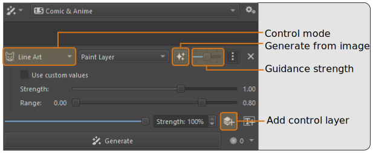
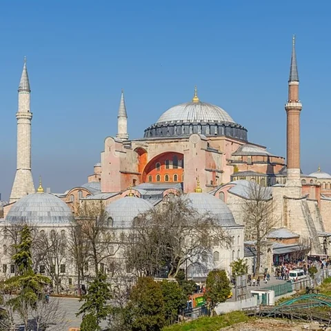
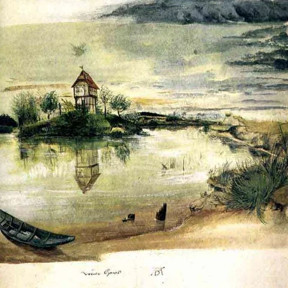
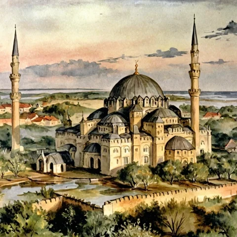
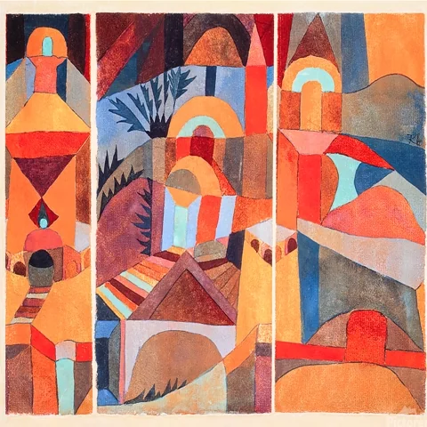
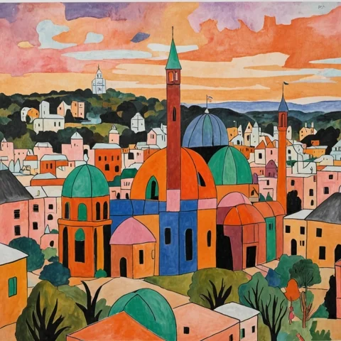

import { Aside, Steps } from '@astrojs/starlight/components'
import PluginIcon from '../../components/PluginIcon.astro'
import SideBySide from '../../components/SideBySide.astro'

Control layers are all about guiding generation with images. It's a
common term for technology like _ControlNet_ or _IP-Adapter_.

## Usage

Creating control layers is easy:
<Steps>
1. Create a new layer or select an existing one.
2. Click the <PluginIcon name="control-add" text="Add control layer" /> button.
3. Choose a control layer type.
</Steps>

You can switch the layer afterwards, and there is a slider which controls the
guidance strength. Higher strength makes generated images stick to the control
layer content more closely.

### Generating control layers

At this point you might be wondering what to put into a control layer. A great
way to discover is to automatically derive control layer content form an
existing image. This is usually the opposite of what you're trying to do (ie.
generating an image with the guidance of control layer content). Here is how:

<Steps>
1. Create a control layer as described above.
2. Make sure you have an image currently visible on the canvas.
3. Click the <PluginIcon name="control-generate" text="From image" /> button.

    If the docker size is small, the button might be hidden inside the <PluginIcon name="more" text="Advanced options" />.
    If there is no button, the control layer mode you selected doesn't support it. Not all of them do.

4. A new layer will be created with the control layer content. It also becomes the active layer.
</Steps>

### Advanced options

The extended options provide more fine-grained control over the guidance strength:
* **Strength**: Weight of the additional embeddings or conditions.
* **Range**: The sampling step range in which the control layer is applied.
  This slider can be modified at the beginning and end. 
  Diffusion happens in multiple steps. Setting eg. start to 0.2 and end to 0.7 means
  the first 20% of the steps happen _without_ control layer guidance. The control 
  layer will be active until 70% of the steps are done.

<Aside type="tip">
Typically broad compositional changes happen at the beginning of the diffusion process.
Details are fine-tuned towards the end. Use the range slider depending on which stage
you want to affect.
</Aside>

## Control layer modes

The different modes can be broadly categorized into two groups.

### Reference images

These modes use the control image similar to how text is used to guide
generation. Subjects, color, style, etc. are taken from the control image and
forged into something new. Control images can have a different size and format
as the canvas: it is best to use **square** images. Details from high resolution
images will likely be lost.

<Aside type="tip">
It's okay for part of the layer to be transparent. Those areas will be ignored.
</Aside>

#### <PluginIcon name="control-reference" simple /> Reference

Subjects, composition, colors and style are taken from the control image. They
influence the generated image similar to how text prompts do, allowing the model
some freedom to deviate from the input.

<SideBySide img1="control-layers/reference-control" img2="control-layers/reference-image" />

#### <PluginIcon name="control-style" simple /> Style / <PluginIcon name="control-composition" simple /> Composition

Similar to reference, but focuses on taking only the style (or composition) from
the control image. The distinction is not always very clear. Works best with SDXL.

<table>
<thead>
<tr>
<th style="width: 30%">Composition (control input)</th>
<th style="width: 30%">+ Style (control input)</th>
<th style="width: 30%">Generated image</th>
</tr>
</thead>
<tbody>
<tr>
<td style="padding: 0.5rem;"></td>
<td style="padding: 0.5rem;"></td>
<td style="padding: 0.5rem;"></td>
</tr>
<tr>
<td style="padding: 0.5rem;"></td>
<td style="padding: 0.5rem;"></td>
<td style="padding: 0.5rem;"></td>
</tr>
</tbody>
</table>

#### <PluginIcon name="control-face" simple /> Face

Replicates facial features from the control image. Input must be a cropped image
of a face. It's best not to crop too closely, a bit of padding is fine. 

<SideBySide img1="control-layers/face-control" img2="control-layers/face-image" />

### Structural images

The control image has a per-pixel correspondence to the generated image. It
should be the same size of the canvas. Elements of the control image will appear
in the generated image in the exact same position (or at least close).

#### <PluginIcon name="control-scribble" simple /> Scribble
Scribble, line art, and soft edge use sketches and lines as input. These can
be generated or drawn by hand.

<SideBySide img1="control-layers/scribble-control" img2="control-layers/scribble-image" />

#### <PluginIcon name="control-line_art" simple /> Line Art

<SideBySide img1="control-layers/line_art-control" img2="control-layers/line_art-image" />

#### <PluginIcon name="control-soft_edge" simple format="png" /> Soft Edge

<SideBySide img1="control-layers/soft_edge-control" img2="control-layers/soft_edge-image" />

#### <PluginIcon name="control-canny_edge" simple format="png" /> Canny Edge
Canny edge input is usually generated from existing images
using the Canny edge detection filter.

<SideBySide img1="control-layers/canny_edge-control" img2="control-layers/canny_edge-image" />

#### <PluginIcon name="control-depth" simple format="png" /> Depth
Depth and normal maps can be rendered from 3D scenes in software like Blender.

<SideBySide img1="control-layers/depth-control" img2="control-layers/depth-image" />

#### <PluginIcon name="control-normal" simple format="png" /> Normal

<SideBySide img1="control-layers/normal-control" img2="control-layers/normal-image" />

#### <PluginIcon name="control-pose" simple /> Pose
Pose uses OpenPose stick figures to represent persons. It can be edited with Krita's
vector tools.

<SideBySide img1="control-layers/pose-control" img2="control-layers/pose-image" />

#### <PluginIcon name="control-segmentation" simple /> Segmentation

<SideBySide img1="control-layers/segmentation-control" img2="control-layers/segmentation-image" />

#### <PluginIcon name="control-blur" simple /> Unblur
The control input is a blurred version of an image. At high strength the result will
be very similar to the input, but less blurry (if resolution allows). In combination
with advanced options this can also be used to generate faithful copies of an image
while allowing certain limited modifications.

<SideBySide img1="control-layers/unblur-control" img2="control-layers/unblur-image" />

#### <PluginIcon name="control-stencil" simple /> Stencil
The input is a black and white image. It acts as a pattern which is imprinted on the
generated image. Originally this was used for creative ways to represent QR codes.

<SideBySide img1="control-layers/stencil-control" img2="control-layers/stencil-image" />
_Hint: Stepping away from the screen or squinting might help to see the effect._