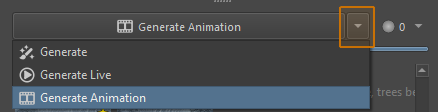

import { Aside } from '@astrojs/starlight/components'
import PluginIcon from '../../components/PluginIcon.astro'
import ImageSample from '../../components/ImageSample.astro'

Custom graphs allow you to design node graphs in ComfyUI and run them from
Krita. Images, layers, selections and masks can be exchanged, and important
parameters can be exposed.

## Introduction

### Why custom workflows?

Most of the plugin functionality focuses on providing basic but very flexible
tools that mesh well with digital painting techniques. But there are also a vast
number of rather specific AI models, algorithms and parameters, which may save a
lot of work in certain scenarios. Custom workflows allow you to integrate those
into Krita.

### Who can use custom workflows?

To use custom workflows you need to use a managed or custom (local/remote)
ComfyUI server installation and have plugin version 1.26.0 or later installed.

To _author_ workflows, knowledge of ComfyUI and basic understanding of image
diffusion technology is required.

But anyone can _use_ workflows shared by others: import them in Krita and tweak
its parameters directly in the UI.

### How does it work?

In a nutshell, a custom workflow is a ComfyUI workflow with special placeholder
nodes. You design the workflow in ComfyUI's web interface, but you execute it
from within Krita. The plugin will generate a custom UI for each workflow, and
connect placeholders with the real input and output.

<Aside type="note">
You can load workflows directly from your browser tab. They will synchronize and
run automatically on any changes you make. But you cannot execute them from
Comfy's web UI.
</Aside>

## The Custom Workspace

You run custom node graph workflows from the Graph workspace.

### Importing workflow files

You can import workflows from files. Workflow files are just ComfyUI workflows
(_*.json_) which contain at least a `Krita Output` node.

Workflows are stored in the _workflows_ folder in your [user data folder](/common-issues#file-locations).

### Connecting to Web UI

Clicking the ComfyUI Web button will launch your browser and navigate to the
ComfyUI instance the plugin is connected to (skip this if you already have it
open). To use the workflow currently loaded in the web UI you have to at least
create a `Krita Output` node - after you do the instance can be selected from
the drop-down.

### Exporting workflows

Use the save button to export the current workflow as a file. Alternatively you
can use the _Export (API)_ option from the Web UI. The _Export_ option (not API)
from Web UI also works to some extent, but is not recommended. UI-specific
features like "bypass" do not work after import.

<Aside type="note">
To use the _Export (API)_ option in ComfyUI, you may need to enable _Dev Mode_
in ComfyUI settings.
</Aside>

## Creating Workflows

This section focuses on special nodes that are used to interact with Krita.

### Output

<ImageSample src="custom-graph/krita-output.png" alt="Krita Output node" scale={1.25} />

The most important node is `Krita Output`. It enables workflow synchronization
and allows Krita to receive images. Simply use it as a sink node for your
results in place of nodes like `Save Image` or `Preview Image`.

Technically no other nodes are needed to use a workflow from Krita. You can also
have multiple outputs, or pass batches of images to the output node, although in
_Live_ mode only the first result will be shown.

##### Inputs

* `images`: The image to send to Krita. Can be a single image or a batch.
* `offset x/y`: *(Optional)* Offset in pixels at which to insert images into the canvas.
* `name`: *(Optional)* Name of the Krita layer that is created when the result is applied.
* `batch mode`: *(Optional)* How batches of images are interpreted.
  * `images`: Each image is a separate result.
  * `animation`: Each image becomes a frame in an animation.
  * `layers`: All images are applied, each as a separate layer.
  * `default`: Either `images` or `animation` depending on the generation mode selected in Krita.
* `resize canvas`: *(Optional)* Resize the Krita canvas to match when the image is applied.

### Canvas

This node provides information about the Krita document / canvas. It gives you
the current image (ie. "what you see", all visible layers). But even if you
don't need the image in your workflow, you most likely want to use this node to
get the canvas resolution.

|                 Text-to-Image                  |                 Image-to-Image                 |
| :--------------------------------------------: | :--------------------------------------------: |
|  |  |

<Aside type="caution">
Outputs from diffusion models always use a resolution that is a multiple of 8,
16 or 64. If the Krita canvas doesn't match, you may have to additionally crop
or resize the diffusion result right before sending it to `Krita Output` to
match the expected resolution.
</Aside>

### Parameters

For each custom workflow the Plugin generates a complementary UI, so important
parameters can be tweaked directly from Krita. Which parameters are exposed is
explicit: you create a `Parameter` node for each. This allows you to assign a
name and tweak UI elements (eg. define slider range).

All values that can be configured in node widgets can be converted into
parameters. In the Web UI, use _Right click > Convert Widget to Input_ on a
node. Then connect it to a parameter node. It will automatically match the type
and name of the parameter and create the corresponding UI on Krita side.

#### Parameter Order and Groups

To define in which **order** parameters should appear, prefix them with a
numeral like `1. `, `2. `, and so on. The number is not displayed, but it's used
to sort the parameters. The absolute value of the numbers does not matter, only
their relation to each other (gaps are fine).

To create **groups**, use a forward slash `/` to separate group name from
parameter name. For example `My Group/My Parameter`. You can also choose the
order in which groups appear, as well as parameters within them. Groups can not
be nested.

### Selection and Layers

    

Individual layers can be used inside custom workflows. The `Krita Image Layer`
node will add a UI widget to select an RGB layer, while `Krita Mask Layer` is
for selection and transparency masks.

#### Selection Context

<ImageSample src="custom-graph/krita-selection.png" alt="Krita Selection node" scale={1.25} />

You can build inpaint workflows similar to the ones integrated in the Plugin by
reading the current selection with the `Krita Selection` node. The selection can
be used like a mask. Use the selection context to limit the input image and mask
to an area around the selection. Check the [examples section](#example-workflows) 
for a workflow.

##### Inputs

* `context`: Defines the crop size of the input image and mask. Affects `Krita Canvas` and `Krita Selection` outputs. Does not affect individual layers.
  * `entire image`: The entire canvas is used. Offsets are 0.
  * `mask bounds`: The tight bounding box of the selection defines the image crop size.
  * `automatic`: The bounding box of the selection is extended according to Krita settings.
* `padding`: Number of pixels to extend the crop area on each side.

##### Outputs

* `mask`: The selection as a transparency mask. If there is no selection all pixels are 1.
* `active`: Boolean value indicating whether there is an active selection.
* `offset x/y`: Offset of the cropped area in pixels. Typically this is
  connected to the offset inputs of the `Krita Output` node.

### Style

In the Plugin, Styles are a way to define and reuse a set of models and
settings. It's possible to use one (or more) Styles in custom workflows by
adding the `Krita Style` node. It will load the configured model (checkpoint,
diffusion model or GGUF) as well as Clip and VAE. It also applies LoRA and model
settings like clip skip.

Prompt templates configured in the Style are exposed as text - you will probably
want to merge them with a flexible input prompt inside your workflow before
encoding them. Sampler settings are exposed to the workflow as names, they can
be used as input to nodes like `KSampler`.

<Aside type="note">
Some samplers like _AlignYourSteps_ are not available as names
and need to be modeled in the workflow explicitly.
</Aside>

### Send Text

This node allows you to send any information to the Plugin as text.

## Animations

When selecting the <PluginIcon name="workspace-animation" text="Generate
Animation" /> mode, some nodes support transferring multiple images from Krita's
animation timeline:

* `Krita Image Layer` will send all keyframes in the current playback time range
  as an image batch.
* `Krita Mask Layer` will send all keyframes in the current playback time range
  as a mask batch.
* `Krita Output` consumes a batch of images and returns them as an animation,
  rather than individual images. When applying the result, a new layer with
  keyframes is created.

Note that `Krita Canvas` does _not_ support animations and always displays the
current view only.

## Example Workflows

To view the samples, download the workflow .json file and drag it into ComfyUI's web UI.

* Custom Workflow Example: [krita-custom-workflow.json](/resources/krita-custom-workflow.json)
* Inpaint with Selection: [krita-inpaint-workflow.json](/resources/krita-inpaint-workflow.json)