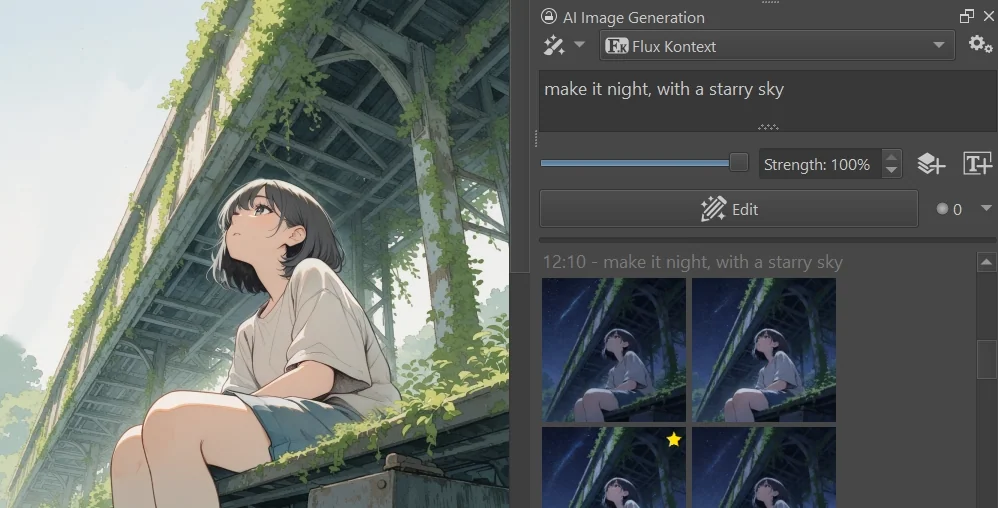
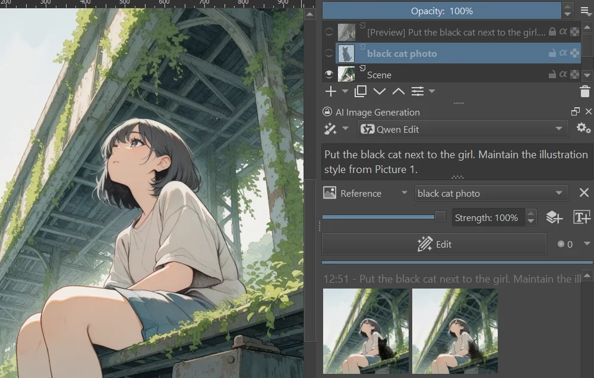

import { Aside, Steps } from '@astrojs/starlight/components'
import { Image } from "astro:assets"
import ImageSample from '../../components/ImageSample.astro'
import ImageGrid from '../../components/ImageGrid.astro'
import PluginIcon from '../../components/PluginIcon.astro'

Edit models are diffusion models which are trained to manipulate an existing
image based on text instructions. They are useful when you want to modify a
certain aspect of an image, but keep the rest intact. For example:
* Change the pose of a character
* Change the lighting or weather conditions
* Add or remove objects from a scene
* Change the style of an image (e.g. from photo-realistic to cartoon)

<ImageGrid images={[
  'edit-models/example-original.webp',
  'edit-models/example-night.webp',
  'edit-models/example-cat.webp',
  'edit-models/example-extract.webp'
]} captions={{
  'edit-models/example-original.webp': 'Original Image',
  'edit-models/example-night.webp': '"make it night, with a starry sky"',
  'edit-models/example-cat.webp': '"add a black cat sitting next to the girl"',
  'edit-models/example-extract.webp': '"extract the girl from the image. show her standing in a natural pose. white background."'
}} />   

### Comparison with "Regular" Models

##### Image Input
Unlike other models, Edit models are designed to work on an existing image.
They are not as good at generating images from scratch.

##### Text Prompt
Edit models take _commands_ as text prompts, for example "make it sunny" or
"change the color of the woman's dress to light blue". In contrast, regular
models typically take descriptive prompts that describe the entire scene.

##### Strength
Edit models are typically used at 100% strength. Lower values often prevent any
change happening at all.

##### Selections
Both model types support selections to constrain the area of effect.

### Supported Edit Models
The Krita Plugin currently supports the following edit model architectures:
* Flux Kontext
* Flux 2 Klein _(experimental)_
* Qwen Image Edit _(experimental)_

### How to Use Edit Models
This section uses the _Flux Kontext_ model as an example. The steps are the same
for other supported edit models.

<Steps>
1. Install the Edit Model

    Edit models are installed like other models. If you are using a managed
    server, simply select them from the list of available models. Custom server
    users download and drop the model file into the `models/diffusion_models`
    folder.

    <ImageSample src="edit-models/install.png" scale={1.5} alt="Install Edit Model" />

    <Aside type="note">
    Depending on your GPU, the name of the model can be slightly different (Nunchaku, fp8, fp4...).
    Those are all versions of the same model. This also affects the file name in the next step.
    </Aside>

2. Select a Style which uses the Edit Model

    There are built-in styles for editing, like _Flux Kontext_. Like any other
    style, you can copy and customize them to your needs. If you are using a
    custom edit model and it is not detected as such, you can manually set the
    architecture to "Flux Kontext" in the style settings. Usually you can leave
    it on "Automatic".

    <ImageSample src="edit-models/style.png" scale={1.5} alt="Select Edit Style" />

    Alternatively you can switch a regular style into [edit mode](#linking-edit-styles).

3. Prepare the Image

    Make sure the image you want to edit is visible in the Krita canvas. All
    visible content (merged layers) are used as primary input for the edit
    model. 
    
    While technically any resolution and aspect ratio is supported, edit models
    are often sensitive to image size and work best around 1MP. Selections can
    help reduce effective resolution by only editing part of the image.

4. Write your Instructions

    In the text prompt field, write the instructions for the modification you
    want to make. Be specific. Identify objects in the image by describing them
    via a unique feature, then specify the desired change. It is also
    recommended to explicitly mention things that should remain unchanged. Make
    changes one at a time.

    Examples:
    * "Make it sunny"
    * "Make the man wear medieval armor"

    For a more comprehensive guide, see [Flux Kontext Prompting Guide](https://docs.bfl.ai/guides/prompting_guide_kontext_i2i).

5. Press the <PluginIcon name="edit" text="Edit" /> button

    
</Steps>

### Combining multiple images

You can use multiple images as input for edit models for various tasks:
* Use a second image as reference for style transfer
* Put objects from one image into the scene of another
* Apply clothing or accessories to a character
* etc.

Your primary image will always be the visible content in the canvas. To add
additional images, put them in a separate layer, and click the 
<PluginIcon name="control-add" text="Add control layer" /> button. You can hide
the additional layer so it doesn't get in the way. Multiple images can be added
this way, but each will significantly increase memory usage and processing time.

To reference input images in your instructions it is best to succinctly describe
their content. For latest _Qwen Image Edit_ models you can use "Picture 1" for
the main canvas, and "Picture 2", "Picture 3", etc. for additional reference
images, in the order they are listed in the UI.

### Linking Edit Styles

You can link an existing style for editing in the style settings of a regular
image generation model . This allows you to switch between generation and
editing without switching styles.

<ImageSample src="edit-models/link-edit-style.png" scale={1.5} alt="Link Edit Style" />

When you select an image generation style that has an edit style linked, use the
dropdown menu next to the <PluginIcon name="generate" text="Generate" /> button
to switch to edit mode. Edit mode stores its own text prompt to easily switch
between full generation and edit instructions.

<ImageSample src="edit-models/edit-mode.png" scale={1.5} alt="Switch to Edit Mode" />

<Aside type="note">
_Flux 2 Klein_ supports both image generation and editing in the same model.
You will be able to switch between "Generate" and "Edit" modes without linking
a separate style.
</Aside>

### Common Issues

#### No "Edit" button
When selecting a Style that uses an edit model, the "Generate" button in the
Docker is replaced with "Edit". If you still see "Generate", the Style may not
be configured correctly. Check the Style settings to ensure it is using an edit
model. If you think the model is not detected correctly, you can manually set
the architecture in "Checkpoint configuration (advanced)".

#### Images look unchanged
If the generated image looks identical to the input image, it is likely because
the model did not understand the instruction. Try rephrasing the prompt.

In some cases certain instructions may not be supported by the model at all.
Current edit models tend to be extremely good at various tasks they've been
trained on, but can struggle with anything outside of that scope. LoRA can
extend the capabilities of edit models in some cases.