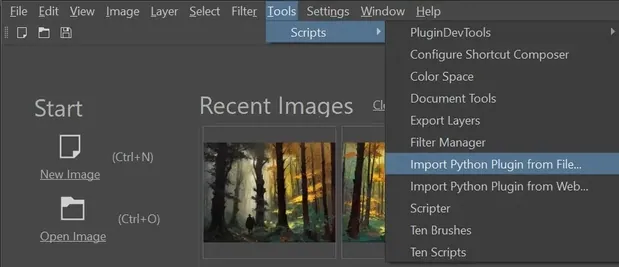
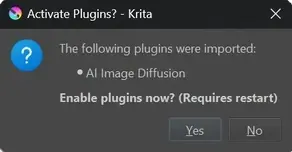
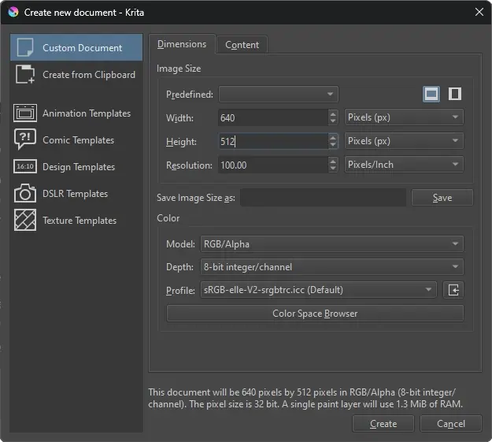
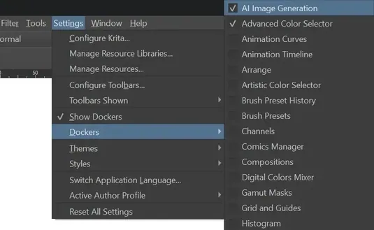
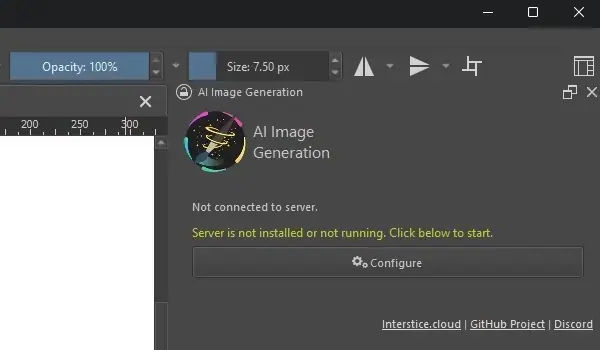
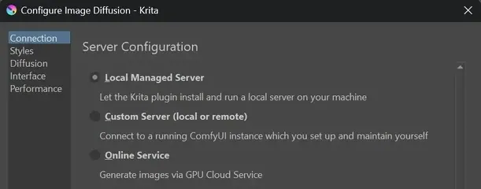
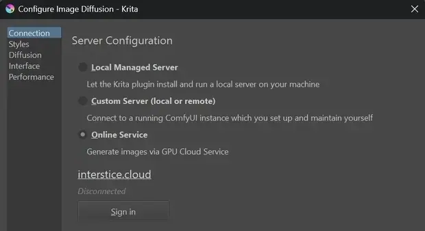
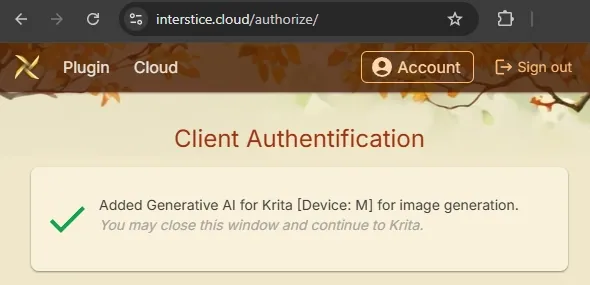
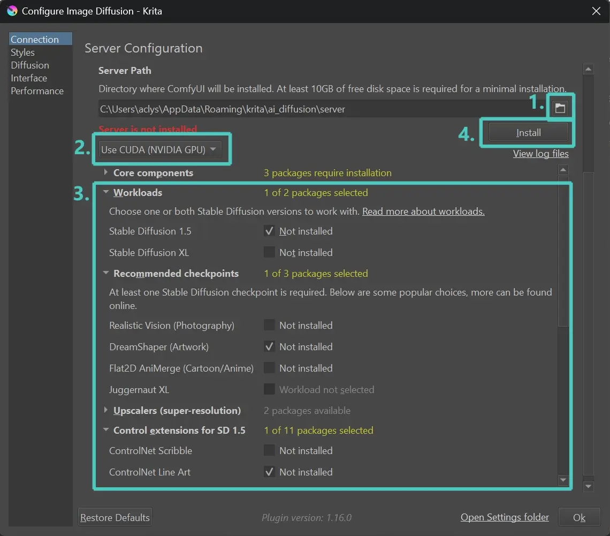

import { Aside, Steps } from '@astrojs/starlight/components';
import { Icon } from 'astro-icon/components'
import ExternalLink from '../../components/ExternalLink.astro';
import Soft from '../../components/Soft.astro';
import Hint from '../../components/Hint.astro';

This is a step-by-step guide for downloading and installing the Generative AI plugin for Krita.

## Installing the Plugin

<Steps>

1. Make sure you have Krita version **2.2** (or later) installed.

   You can download and install it from <ExternalLink href="https://krita.org/en/download">krita.org</ExternalLink>.

2. Download the Plugin

    Download the <ExternalLink href="https://github.com/Acly/krita-ai-diffusion/releases/latest">latest release</ExternalLink> of the Plugin.
    Remember where you save the ZIP file.

3. Install the Plugin

    Run Krita. Go to _Tools ▸ Scripts ▸ Import Python Plugin from File..._

    
    
    Select the ZIP file you just downloaded. When prompted to enable the Plugin, press Yes.

    
    
    _Now Krita needs to be restarted!_

4. Enable the Docker
        
    In Krita, create a new Document. For starters, choose a low resolution.

    
    
    Enable the Plugin Docker from the Menu bar: _Settings ▸ Dockers ▸ 🗹 AI Image Generation_

    
    

5. Configure Image Generation
                    
    The Plugin is installed now and you should see the Docker appear.

    
    
    To generate images you also need a backend server. Click Configure to choose between multiple options:

    
    
    * **Local Managed Server**

        The Plugin will download and install the server on your system. 
        Requires a powerful GPU!
        Continue reading [below](#local-server-installation) for details.

    * **Online Service**

        Create an account and generate images on cloud GPU workers. 
        This requires no installation or hardware on your end. [Pricing and Terms](https://www.interstice.cloud/service)

    * **Custom Server**

        The Plugin can connect to an existing [ComfyUI](https://github.com/comfyanonymous/ComfyUI) server, either local or remote.
        
        Read about [required custom nodes and models here](/comfyui-setup).
        This is the most flexible option, but some technical knowledge is required.

        <Aside type="caution">If you choose this option, it is your responsibility to install and run the server. Instructions and tutorials for ComfyUI can be found online.</Aside>

6. Connect to Online Service _(Optional)_

    Press the Sign in button. This should open your browser, where you need to
    log in, or sign up for an account.

    
    
    Once done, you should see the confirmation screen and can start generating
    images!

    
</Steps>

## Troubleshooting

Please check [Common Issues](/common-issues)
and <ExternalLink href="https://github.com/Acly/krita-ai-diffusion/issues?q=is%3Aissue">search for existing issues</ExternalLink>.

If you cannot find a solution to your problem, open a <ExternalLink href="https://github.com/Acly/krita-ai-diffusion/issues">new Issue</ExternalLink>.

For questions, reach out via <ExternalLink href="https://github.com/Acly/krita-ai-diffusion/discussions">Discussions</ExternalLink>
or join us on <ExternalLink href="https://discord.gg/pWyzHfHHhU">Discord</ExternalLink>.

<Aside type="caution">
Official Krita channels cannot offer support for issues related to the plugin.
</Aside>

## Local Server Installation

These steps are only required if you selected **Local Managed Server** as the backend.

<Steps>
1. Hardware requirements

    <table className="mb-2">
        <tbody>
            <tr>
                <td><Icon name="bootstrap/nvidia" /> NVIDIA</td>
                <td>GTX 1060 6GB or better. <Soft>You may encounter issues and limitations on older cards.</Soft></td>
            </tr>
            <tr>
                <td><Icon name="bootstrap/amd" /> AMD</td>
                <td>12GB VRAM or more. Slow with limited feature set. <Soft>Custom install required for Linux.</Soft></td>
            </tr>
            <tr>
                <td><Icon name="bootstrap/apple" /> Apple</td>
                <td>Apple Silicon via MPS (community support).</td>
            </tr>
            <tr>
                <td><Icon name="simple/intel" /> Intel</td>
                <td>Intel Arc Graphics cards, 8GB or better.</td>
            </tr>
            <tr>
                <td>CPU</td>
                <td>Works, but is very slow.</td>
            </tr>
        </tbody>
    </table>
    
    _Please make sure you are using an up-to-date GPU driver!_

2. Operating System
                    
    Windows, Linux or macOS

    <Hint>
        <Icon name="bootstrap/windows" /> _Windows users_

        Some packages cannot be installed while running the **Windows Store** or **Steam** versions of Krita.
        It is recommended to download Krita directly from <ExternalLink href="https://krita.org/en/download">krita.org</ExternalLink>.
    </Hint>

    <Hint>
        <Icon name="awesome/linux" /> _Linux users_

        Some packages cannot be installed while running the **Flatpak** version of Krita.
        It is recommended to use the **AppImage** instead.
    </Hint>

3. Installation

    1. Choose a path where to install. 
        <Soft>Keep in mind AI models can be very large, 10GB is a minimum, 50GB+ not unusual depending on optional packages.</Soft>
    2. Choose a backend. CUDA only works for NVIDIA GPUs. Use DirectML for AMD.
        <Soft>Make sure to do this _before_ you install!</Soft>
    3. Select packages. You need at least one workload and one checkpoint. 
        <Soft>Everything else is optional and will considerably increase download size. You can come back later and add packages at any time.</Soft>
    4. Click install!
    
    
</Steps>
