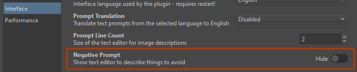
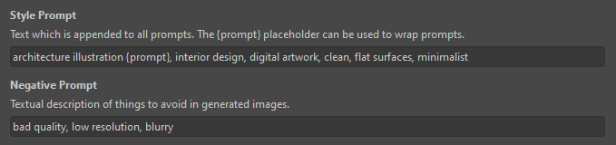
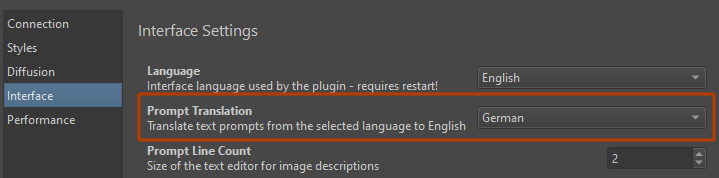
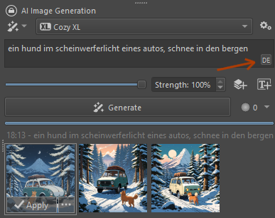

import { Aside } from '@astrojs/starlight/components'

Prompts are the pieces of text you enter to instruct the AI model what to
generate.

To some it is an arcane art, and there are many opinions and mystic invocations
floating around. Here we won't go into that, but  will simply describe some
things you can do in the Krita plugin which aren't obvious at first glance.

## Text input

Generally text should be in English and contain letters, numbers, ` ` (space or
new line), `.` (period) and `,` (comma). Most other things are either ignored,
or have special meaning.


### Negative prompt

Negative prompts can be used to avoid certain content in images. It's not a
straight-forward mechanism though, and using it effectively requires some
understanding of what it does on a technical level. It is not exposed in the
plugin's docker by default, but it can be enabled in Interface settings.



### Style prompt

Text from the Style settings is merged with the text entered for the current
document. This is useful to avoid repeating general trigger words for content
type and quality.



Usually text from the Style settings is appended at the end. The `{prompt}`
placeholder can be used to indicate the position where the document's text
should be inserted.

### Emphasis

You can increase or reduce the weight of individual words or phrases in your
text. You do this with brackets.

Examples:

| Prompt | Explanation |
|:-|:-|
| `a violet rose an a rooftop terrace at (dawn)` | emphasize _dawn_ (weight 1.1) |
| `a violet rose on a (rooftop terrace:1.3) at dawn` | emphasize _rooftop terrace_ (weight 1.3) |
| `a (violet:0.8) rose on a rooftop terrace at dawn` | de-emphasize _violet_ (weight 0.8) |

<Aside type="tip">
Use Ctrl + Up/Down (Arrow key) in the text editor to increase/decrease the
weight of the word under the cursor. Also works for selections.
</Aside>

## LoRA

LoRA models can be added in the Style settings. But they can also be used with a
special syntax directly from the text input.

Examples:

| Prompt | Explanation |
|:-|:-|
| `banana <lora:food_photography>` | load the _food_photography.safetensors_ LoRA (weight 1.0) |
| `apple <lora:food_photography:0.5>` | load the _food_photography.safetensors_ LoRA (weight 0.5) |

Note that the LoRA directives can appear anywhere in the text, it doesn't
matter. They will be removed from the final prompt.

You will also get auto-completion help when typing to make it easier to select
the correct file.

## Translation

To use languages other than English for text prompts, automatic translation can
be activated in Interface settings.



This will show an indicator with the selected language mode in the text input
box.
* Click the indicator to temporarily disable translation. It will show `EN` to
  indicate text is expected in English.
* Ctrl + Click the indicator to immediately translate and replace the current
  text. (Requires local server)



By default only text entered in the text box for documents is translated:
* ✓ includes text for regions
* ✓ includes negative prompts if they're enabled
* ✖ does **not** include any text from Style settings!

### Language directives

Sometimes you might run into a situation where there is a mixture of text that
needs translation, and specific phrases, tags or instructions which are already
in English and should not be touched. For full flexibility, the language can
also be indicated directly in the text. This still requires translation to be
enabled in general.

Language directives use the syntax `lang:XX`, where XX is a 2-letter language
code. Example:
```
lang:en origami paperwork, lang:zh 狐狸和鹤, lang:en mountain view
```
This would result in the following text to be sent to the model:
```
origami paperwork, Fox and crane, mountain view
```

Technically you can have as many directives as you want, and combine multiple
languages.