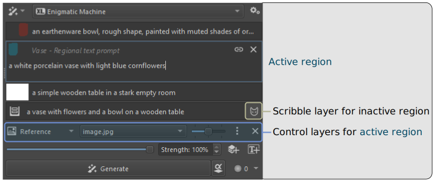

import { Aside, Code, LinkButton, Steps } from '@astrojs/starlight/components';
import { YouTube } from '@astro-community/astro-embed-youtube';
import PluginIcon from '../../components/PluginIcon.astro';

Regions are a way to assign text prompts and reference images to specific areas
in the image.

## Introduction

When writing a prompt for an entire image the text instructions can easily
become quite complex. It's possible to describe objects in different parts of
the image with phrases like "on the left", "on the right", "in the corner" but
it's not intuitive or precise. It's also common that colors, attributes and
concepts get mixed up and muddled.

Observe the following example:
```txt wrap
a simple wooden table in a stark empty room, on the left a white porcelain vase with light blue cornflowers, on the right an earthenware bowl, rough shape, painted with muted shades of orange and red
```


These are the first few outputs from SDXL. Note that colors and descriptions are
all over the place. A model with better text understanding (eg. Flux) would do
much better for this simple example, but runs into similar issues for longer
descriptions with more subjects.

Let's try with regions:


```txt wrap title="Right region (red area)"
an earthenware bowl, rough shape, painted with muted shades of orange and red
```
```txt wrap title="Left region (blue area)"
a white porcelain vase with light blue cornflowers
```
```txt wrap title="Background region (white area)"
a simple wooden table in a stark empty room
```
```txt wrap title="Root region"
a vase with flowers and a bowl on a wooden table
```

The prompt is split up between three regions. Specifying "on the left", "on the
right" in the text is no longer needed. Instead there is a "Root" prompt which
describes the overall composition of the image without going into details.


Again, these are the first results with the same model and parameters as above.
The images aren't perfect, but subjects are cleanly separated as indicated by
the coverage of the region layers.

### Composition

Regions are _not_ a tool for composition. This is a frequent misunderstanding.
They constrain text prompts to specified areas, but do not enforce subjects to
match a certain shape, or even be generated at all!

The following setup with two small regions does not lead to the desired result:


Instead, consider using a compositional tool like sketch, lines or depth
[Control layers](). The following example combines a sketch with regions. Note how
the regions need not be particularly precise:


Alternatively build your image from the ground up with [Regions in Live mode](#live-mode).

### Advantages

As text-to-image models become more powerful their understanding of spatial
instructions improves. "Prompt bleeding" becomes less of an issue. But there are
many reasons regions remain useful:
* Defining areas is more intuitive and direct. You don't have to translate
  canvas areas into prose, you can just point and say _there_.
* More precise. Translating areas into text and having the model translate them
  back into spatial information introduces a lot of vagueness.
* Allows for more complex prompts. Even the latest models become less precise
  the longer the text prompt. Splitting it up helps.
* Improved inpaint workflow. Regions are not only useful for generating the
  whole image! It is quite common to go back and forth between different
  selections and refine each individually. With regions you don't have to swap
  out text, control layer and reference images each time. You can assign them
  per area/layer instead.
* Infinite complexity via [Region hierarchies](#region-hierarchies). 


## Basics

This section covers some general advice for using regions.


### Creating regions

To create a region, use the <PluginIcon name="region-add" text="Add Region" /> button next to the text input.

Regions must be attached to paint layers or layer groups. When creating a new
region, it is linked to the active layer by default. If the active layer already
has a region, creating a new region will automatically create a new layer. 

The area covered by a region is defined by the pixel opacity of the layer it is
linked to. Fully transparent pixels are not affected by the region.

Selecting a region's text input will also make the linked layer active, and the
text focus will follow when switching layers. Regions can be removed with the
<PluginIcon name="remove" /> button - this will remove the associated text, but keep the layer. A
region can also be <PluginIcon name="link" /> linked and unlinked from the active layer.

<Aside type="note">
A regional prompt can be linked to multiple layers. This can be useful when there are
several objects of the same kind spread out over the canvas which share the same attributes.
Conversely, a layer can only be linked to a single region.
</Aside>

### Root prompt

The text input at the very bottom is reserved for the <PluginIcon name="root" text="Root prompt" />.
 It is not linked to any layer. It should describe the general
composition of the image with all its subjects. It may also contain instructions
about style, medium, quality, etc. which apply to the whole image. The Root
prompt is appended to the text of all other regions.

A good way to think about it is that image generation is a global task. To get a
good composition, every region generally needs to be aware of the whole image.
You may describe a sailing ship in great detail in its own region on one side of
the image, and a fearsome Kraken in another, but for a meaningful image to
emerge the ship typically needs to be aware that the Kraken exists and vice
versa. This is accomplished by describing the scene briefly in the Root prompt.

<Aside type="tip">
Describing the scene in the Root prompt is less important when there is another way of
guiding composition, such as existing canvas content or Control layers.
</Aside>

### Coverage and Layer stacking

The area affected by a region follows the stacking logic of paint layers. The
portion of the composited image where a certain layer is visible is also what
defines the coverage for a region it is linked to.


This means layer content is allowed to overlap, layers on top hide parts of
layers below. Image generation always produces a single full image which matches
the _visible_ areas of the individual layers. Applying a generated result
modifies the pixels on all affected layers where they are visible - or creates
new layers when using [groups](#layer-groups).

### Background region

It often makes sense to have a region that covers all the parts of the image
that aren't explicitly covered by other regions, and just contains background.
Because of the way layer stacking works, this can be achieved by having a fully
opaque layer at the bottom of the stack and linking it to a region.

There is nothing special about a background region like that, it works like any
other. If there is no need to have a more detailed description of the
background, it can be omitted entirely. In that case, parts of the images which
are not covered by any region will still follow the Root prompt.

### Layer groups

Instead of linking region prompts to paint layers directly, they can also be
linked to _layer groups_. In that case the covered area is the opacity of all
group layers composited together. Generated results will be applied as a new
layer _for every affected region group_.


The advantage is that coverage can be continuously adjusted by erasing or adding
parts of the layer, eg. to follow the outline of a newly generated result.
[Transparency masks](#edit-coverage-with-transparency-masks) can be used for
more precise control. Generated results remain non-destructive, and can be mixed
or partially reverted by erasing.

The disadvantage is that this creates a lot of layers, which require manual
merging every now and then to keep things tidy.

### Control layers

Each region can have its own set of control layers.



Currently linking control layers to specific regions makes sense for:
* <PluginIcon name="control-reference" simple text="Reference" /> 
* <PluginIcon name="control-composition" simple text="Composition" /> 
* <PluginIcon name="control-style" simple text="Style"/> 
* <PluginIcon name="control-face" simple text="Face" /> 

Other control layers already have a per-pixel correspondence of their content
with the canvas, so regions are less useful. It can still make sense to restrict
them to a region if they don't have content for the entire image, however this
is currently only partially supported. It is recommended to keep them attached
to the root region.


## Workflows

This section describes some common workflows to get started. Once they are set up, regions
are flexible and multi-purpose. You can switch between and combine workflows!

### Regions from scratch

For 100% strength image generation from a blank canvas, regions can be set up in advance:
<Steps>
1. Type a general prompt for the whole image into the text input. This will
   become the [Root prompt](#root-prompt).
2. Click <PluginIcon name="region-add" text="Create region" />. This will transform the existing "Background"
   layer into a region. By default it's white and fully opaque. Fill in some
   text that describes things in the background.
3. Click <PluginIcon name="region-add" text="Create region" /> again. This creates a new layer group with a
   single paint layer, and a region linked to the group. Fill in some text that
   describes your first subject.
4. Use a brush to paint the rough area in which you want the first subject to
   appear. Make sure the area is large enough. This is not the time to be
   precise. Use any color you like.
5. Repeat steps 3. and 4. for other subjects. Keep the total number of regions
   reasonable (recommended 5 or less).
6. Click <PluginIcon name="generate" text="Generate"/> !
</Steps>

### Regions for existing images

This is how to add regions to an existing photo, painting or generated image:
<Steps>
1. Type a general prompt for the whole image into the text input. This will
   become the [Root prompt](#root-prompt).
2. If the entire image is one layer, make sure it is active. Otherwise select
   your background layer (usually bottom-most). If the background consists of
   multiple layers, put them in a group and select the group.
3. Click <PluginIcon name="region-add" text="Create region" />. Fill in some text that describes things in the background.
4. *If your subjects are already on separate layers skip this step.* Select a
   subject from your image (using selection tools). Copy and paste the content.
   This creates a new layer.
5. With the subject layer active, <PluginIcon name="region-add" /> create a new region. Fill in some text
   that describes the subject.
6. Repeat steps 4. and 5. for other subjects.   
</Steps>

### Live mode

Regions in live mode are fundamentally different than in generation mode. Only
the currently active region/layer is generated, along with some padding area
around it for context. This is vital:
* It allows to successively paint regions with immediate feedback (before fully
  setting up _all_ regions).
* Generation remains fast. Regional generation causes a significant slow-down
  per region otherwise.

<YouTube id="PPxOE9YH57E" params="start=67" title="Live Painting with Regions" posterQuality="high" />

<Steps>
1. Type a general prompt for the whole image into the text input. This will
   become the [Root prompt](#root-prompt).
2. Click <PluginIcon name="region-add" text="Create region" />. This will transform the existing "Background"
   layer into a region. Fill in some text that describes things in the
   background and start painting.
3. After you have a decent first draft background, <PluginIcon name="apply" text="Apply" /> it. In live mode this
   will overwrite existing layer content by default.
4. Click <PluginIcon name="region-add" text="Create region" />. This will create a new paint layer. Fill in some
   brief text for your first region/subject. Then paint it (as approximately and
   coarse as you like).
5. Apply and move on to the next region.
</Steps>

 Live mode is a great way to set up the initial draft and composition. It
 probably makes sense to move to generation workspace at some point for better
 quality and upscaling.

 <Aside type="tip">
 Regions are shared between live and generation workspaces! The
 interface is reduced in live mode to focus on canvas and preview. Region
 management (linking/unlinking/removal) is better done in generation
 workspace.
 </Aside>

### Selections

Regions can be used in combination with selections. When using fill or refine
the plugin will check which regions are covered by the selection and apply those
with sufficient coverage during image generation.


*Visualization of the context area (box), selection mask (pink) and regions intersected within.*

Applying a result creates layers for the affected regions only. Keep in mind
though that the actual area affected by fill is typically larger than the
selection to allow for a smooth transition.

<Aside type="tip">
It's common to use selections to refine parts of an image (like a character's
face) with more detailed descriptions. One problem is that interactions with
other subjects/characters are lost, because they are not part of either the
prompt nor the selection. This can be resolved with regional text prompts and a
selection that covers eg. both faces.
</Aside>

### Refine Region

Regions are a great tool to refine individual subjects in the image. It allows
you to assign different text prompts and switch between them simply by switching
layers. To make this workflow easier there is the <PluginIcon name="region-alpha" text="Refine region" /> toggle.
It mainly does two things:
* Uses the active layer coverage as a mask. It's as if you made a selection for
  the content of the layer.
* Ignores sibling regions. Only the active region prompt is used (but
  it is still combined with the Root prompt).


*With Refine region, only the left character is generated. Note there is no selection.*

Refine region can still be combined with a selection to fill or refine a
sub-area of the active layer. It is also a vital part of [region hierarchies](#region-hierarchies).


## Advanced techniques

### Upscaling

Tiled image generation can benefit from regions. Usually text prompts are
problematic in this scenario: Because the image is split into multiple tiles
which are processed individually, a text prompt needs to apply equally well to
all parts of the image. Otherwise the text may negatively impact the result by
describing something that isn't visible in some part of the image, creating a
mismatch. Therefore the default for tiled upscale refinement is to not use text
prompts.

Regions can solve this issue. Descriptions are already assigned to local areas
in the image. Tiled generation will analyse for each individual tile the regions
it is affected by. With matching detailed descriptions in place for all parts of
the image, generation can be guided for improved results.


### Edit coverage with Transparency masks

The easiest way to adjust the area coverage of a region layer is with the
eraser. But this only works for a single layer, and doesn't allow adding to the
area, only removing. Transparency masks can be helpful in those situations. When
added to a region group, they allow adding and subtracting from the covered area
for the whole group without touching individual layers.

### Region hierarchies

Regions can be nested. When work starts on an image, the number of regions
should be low and their size relative to the canvas large. That's because
regardless of your canvas resolution, initial generation will use a lower number
of pixels and too many regions slow down computation a lot.

As work continues, you might want to split up subjects, or describe parts more
precisely. Instead of creating further regions at the top level, you can add
sub-regions inside existing regions. This allows to manage complexity better:
* The UI shows text prompt and details for the current parent region and its
  direct child regions. Other regions remain hidden.
* Generating the whole image will only use top-level regions. Refining a single
  region will make use of its child regions. The total number of regions for
  each generation remains manageable.
* Selections can apply the most relevant regions across the whole hierarchy
  depending on coverage.

