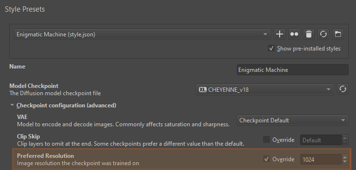
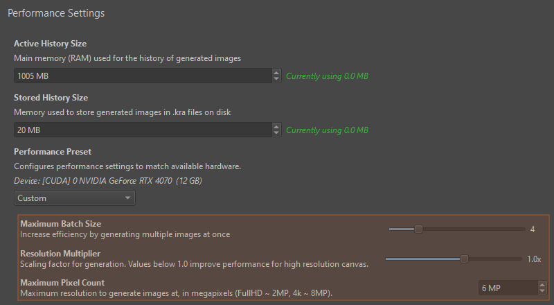

import { Aside } from '@astrojs/starlight/components';
import PluginIcon from '../../components/PluginIcon.astro';

Resolution handling is quite complex, as it has to take into account:
* Desired resolution
* Resolution requirements by the AI model
* Generation speed
* GPU memory (VRAM) usage
* Context areas when using selections

By default the plugin will select resolutions and resize images internally to enable
working with any resolution at reasonable speed. Below are the settings
which allow you to choose your preferred handling and trade-offs.

## Canvas size

The resolution which images are generated at is based on the Krita canvas size.
The plugin will resize images internally only when necessary to meet the
requirements above.

If you want your generations to be less blurry or more detailed, your canvas 
resolution might be the limiting factor. Increase it to get better results!
If you are worried about performance, use one of the [options below](#performance-settings).

<Aside type="note">
Other Diffusion UIs sometimes offer options to generate at a higher resolution
and _downscale_ results to fit the image, to "improve quality/details". This is
an anti-pattern: downscaling means keeping a lower quality version of the result
that was generated. It is always better to upscale existing low-resolution content instead.
</Aside>

## Model requirements

### Checkpoint resolution

The checkpoint resolution is the range of image sizes at which the AI model was trained.
Most models are not able to generate images outside of that range without showing
severe problems. To avoid this, the plugin will automatically resize images, or use
2-pass generation (aka. _hires-fix_). You can override the native checkpoint resolution
in Style settings ▸ Checkpoint configuration (advanced).

### Multiples

All models require image resolutions to be a multiple of 8. Some models
require 16 or 64. The plugin will automatically resize images to meet this
constraint. If you want to avoid quality loss due to scaling images, make sure
your canvas size is a multiple of 8 (better: 64).

<Aside type="note">
When using selections, the plugin will always attempt to choose the context area
in a way that avoids resizing the image.
</Aside>

## Performance settings

### Resolution multiplier

Computes resolution for image generation by multiplying canvas resolution with
the factor configured here. The default is `1.0` (generation and canvas resolution are the
same).

Lower values improve performance at the cost of quality. For example a value
of `0.5` with a `2000 x 2000` canvas will generate images at `1000 x 1000` pixels.

### Maximum pixel count

Caps image generation resolution at a certain number of total pixels. As long as
canvas resolution is lower than the maximum, this setting has no effect. If it is
higher, the generation resolution will be adjusted to fit the limit.

Examples (MP = megapixels = 1 million pixels):
| Canvas | Max pixels | Generation |
|--------|------------|------------|
| `1000 x 800` (0.8 MP) | 1 MP | `1000 x 800` |
| `2000 x 2000` (4 MP) | 1 MP | `1000 x 1000` |
| `2000 x 1000` (2 MP) | 1 MP | `1416 x 712` |

### Upscaling

The <PluginIcon name="workspace-upscaling" /> [Upscale workspace](/basics#upscale) ignores
performance settings like resolution multiplier and maximum pixel count. It
always runs at the upscale target resolution. Because it uses tiling, memory
usage and generation time are kept in check.

### Maximum batch size

This setting doesn't affect the resolution of the generated images. It controls
how many images are generated _in parallel_. Higher numbers require more GPU
memory (VRAM) and slow down generation of a batch. On powerful GPUs this is more
efficient: for example you may get 1 batch of 4 images in the same time as 3
batches of 1 image.

The number you specify here is the number of 512x512 images generated in parallel.
At higher resolutions, the number of images will be lower to keep memory usage
consistent.

<Aside type="note">
This is not the same as _batch count_ (number of batches) in the queue drop-down!
One click of the generate button will schedule _count_ batches. Each batch may
produce multiple images according to the _size_.
</Aside>