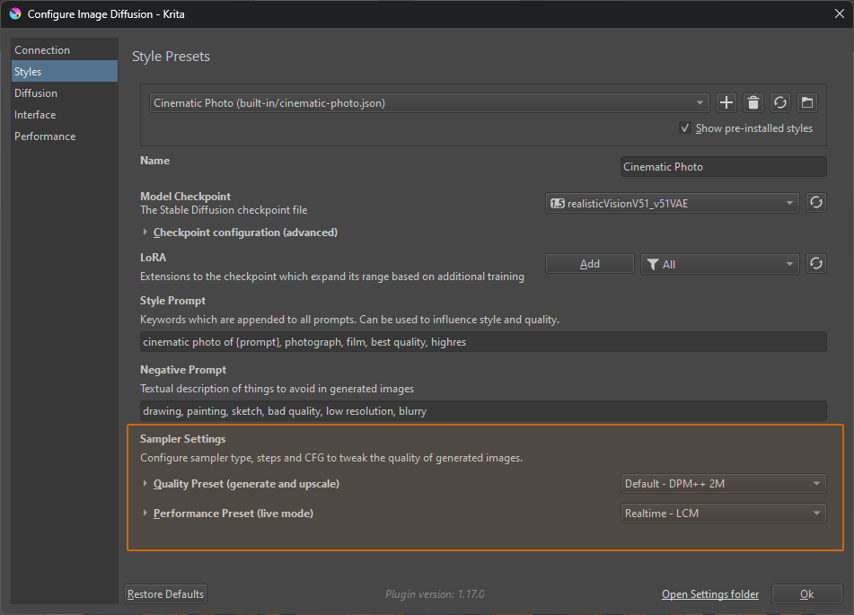
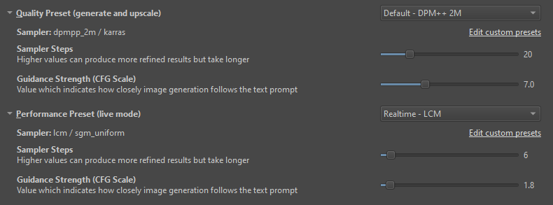
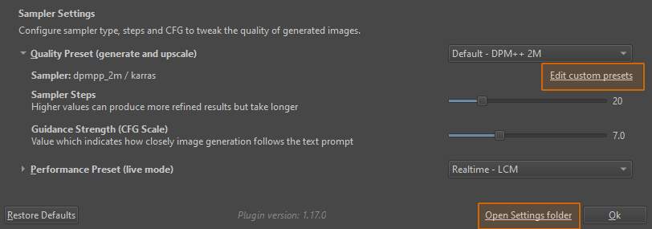

import { Aside } from '@astrojs/starlight/components'
import ExternalLink from '../../components/ExternalLink.astro'

In a nutshell, image generation happens via a process called *Diffusion* over
several discrete steps. From input noise, each step gradually removes a certain
portion of predicted noise, thus revealing a clear image. There are many
approaches to how each intermediate image (a sample) is generated. Those are
called *Samplers*. It is also possible to use different *Schedulers* to control
how much noise is removed each step.

The choice of Sampler and Scheduler is mainly important for two things:
* Trade performance vs quality
* Accommodate models which have been trained with a certain sampler/scheduler

## Recommended Presets

In the Plugin, you can select a Sampler Preset from the Style settings. For most
intents and purposes the defaults should be fine, and there is no need to tweak
them.



If you are downloading custom checkpoints (from sites like <ExternalLink href="https://civitai.com/">civitai.com</ExternalLink>)
it's important to take the type of checkpoint into account.

<Aside type="note">
Often the checkpoint author also has a recommendation on which sampler to use.
</Aside>

### Regular Checkpoints

This covers most checkpoints for SD1.5 and SDXL. They are very flexible and
compatible with a wide range of samplers and workflows.

Recommended presets:
* **Default** - *DPM++ 2M Karras*: converges quickly and is stable regarding step counts.
* **Creative** - *DPM++ 2M SDE Karras*: introduces some noise each step, less stable but more freedom
* **Alternative** - *Euler Ancestral*: similar to the Creative, often recommended for non-realistic
* **Fast** - *UniPC BH2*: faster because it requires fewer steps, with some quality loss

### Turbo & Lightning Checkpoints

Some checkpoints have "Turbo" or "Lightning" in their name. They are models which require fewer sampling steps
and therefore run faster. They retain excellent quality, but usually have less
variation. They also don't work as
well for fill and refinement.

Recommended presets:
* **Turbo/Lightning Merge** - *DPM++ SDE Karras*: most of these checkpoints require this sampler.
* **Lightning Merge** - *Euler A Uniform*: a faster option for Lightning checkpoints.

### Performance and Live mode

There are special sampling strategies which drastically lower the number of
steps required, and thus achieve almost real-time speeds on powerful hardware.
It comes at the cost of quality and subject range.

The Plugin allows to configure separate presets for use in "classic" generation
and Live mode.

Recommended presets:
* **Realtime** - *Hyper*: the default for live painting, it works well even at low strength.


## Steps and CFG

All presets come with a default suggestion for number of steps and CFG
(Classifier Free Guidance) scale. You can tweak them in the Style settings. Each
sampler and checkpoint type have different ranges which they are comfortable
with, it is best to start form the default values and experiment if necessary.



* **More steps** will take longer, but can improve quality. It has diminishing
  returns however, and may even degrade quality at high numbers.
* **A higher CFG** may improve composition and prompt adherence, but will
  eventually "overcook" the image. It usually also requires more steps, which is
  why samplers with low step counts require a low CFG scale.


## Custom Presets

There are many more options which are not reflected by existing presets. Choice
of sampler is mostly a technical consideration. There are a few that work well,
and it's generally not very productive to tweak them. Different samplers will
yield different results, but whether one is better than the other may depend on
a lot of factors, and is often a subjective choice.

That being said, there are legitimate reasons to configure a specific sampler
and scheduler. For these cases you can create your own presets.

### Creating User Presets

The easiest way to start writing custom presets is to click the link in the
Style settings. This will create a `samplers.json` file in the
`<appdata>/krita/ai_diffusion/presets/` folder and try to open it. If this
doesn't work you can use the "Open settings folder" link, it should be there in
the `presets` folder. Open it in a text editor, Notepad will work.



### Example

The built-in presets are all defined in a similar file. You can view it here:
[samplers.json](https://github.com/Acly/krita-ai-diffusion/blob/main/ai_diffusion/presets/samplers.json)

User presets have the same structure. To get started, the file should already
contain an example like the following:
```json
{
    "My Custom Sampler - DPM++ 3M": {
        "sampler": "dpmpp_3m_sde",
        "scheduler": "exponential",
        "steps": 20,
        "minimum_steps": 4,
        "cfg": 7.0
    }
}
```

Feel free to modify it and add more.

<Aside type="caution">
You have to restart Krita for changes in the preset file to take effect!
</Aside>

### Steps, Strength and Minimum Steps

The `steps` configued in a preset are used as initial value when you select that
preset in the UI. The UI allows to override that value. This value is the number
of _total steps_ which run when you generate an image from scratch (100%
strength).

At lower strength values, the image is already partially denoised. At 50%
strength, only half the steps need to run. Each step removes the same amount of
noise from the image as before! But because there is less noise, fewer steps are
required. <ExternalLink href="https://invoke-ai.github.io/InvokeAI/features/IMG2IMG/">See here</ExternalLink> for
a more detailed visual example.

Setting `minimum_steps` changes the noise schedule for low strength values. If
the number of steps would drop below the minimum, the total steps are
automatically rescaled such that the minimum number of steps will run. This can
be beneficial for low strength values and provide the required flexibility to
make subtle changes. But keep in mind that more steps also make the process take
longer.

### Reference

Possible values for `"sampler"`:
* euler
* euler_cfg_pp
* euler_ancestral
* euler_ancestral_cfg_pp
* heun
* heunpp2
* dpm_2
* dpm_2_ancestral
* lms
* dpm_fast
* dpm_adaptive
* dpmpp_2s_ancestral
* dpmpp_2s_ancestral_cfg_pp
* dpmpp_sde
* dpmpp_sde_gpu
* dpmpp_2m
* dpmpp_2m_cfg_pp
* dpmpp_2m_sde
* dpmpp_2m_sde_gpu
* dpmpp_3m_sde
* dpmpp_3m_sde_gpu
* ddpm
* lcm
* ipndm
* ipndm_v
* deis
* res_multistep
* res_multistep_cfg_pp
* res_multistep_ancestral
* res_multistep_ancestral_cfg_pp
* gradient_estimation
* gradient_estimation_cfg_pp
* er_sde
* seeds_2
* seeds_3
* ddim
* uni_pc
* uni_pc_bh

Possible values for `"scheduler"`:
* normal
* karras
* sgm_uniform
* ddim_uniform
* exponential
* simple
* beta
* linear_quadratic
* kl_optimal
* align_your_steps
* gits
* polyexponential
* laplace

Possible values for `"lora"` (optional):
* hyper
* lcm
* lightning
* ... any lora filename, eg. my_lora_file.safetensors