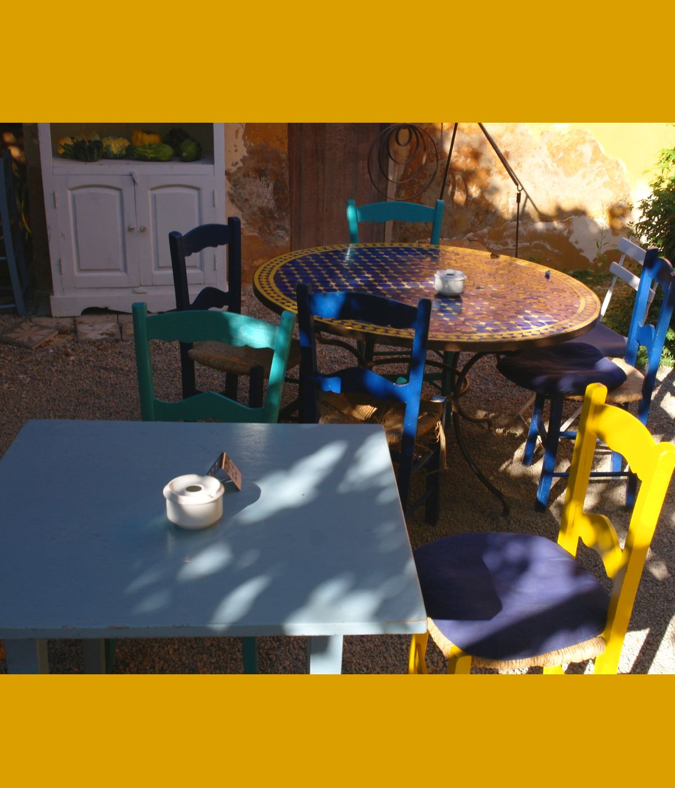

import { Aside } from '@astrojs/starlight/components'
import PluginIcon from '../../components/PluginIcon.astro'
import ImageSample from '../../components/ImageSample.astro'
import ImageGrid from '../../components/ImageGrid.astro'

Using selections to modify parts of the image is a key feature of the plugin. It
allows you to apply AI generation exactly where you want. You can work on an
image iteratively, mixing traditional painting tools and generated content as
needed. This is also known as _inpainting_.

## Generation mode

Creating a selection will transform the "Generate" button to reflect the
operation. By default this is either <PluginIcon name="inpaint-fill" text="Fill" />, or
<PluginIcon name="inpaint-expand" text="Expand" />, depending on the selection context.
But there is also a drop-down which allows you to choose a more specific action
which may yield better results.

### Fill

This is a general purpose mode that fits most scenarios where you want to replace a part of the image with something
similar. It may generate new things, but is biased towards using colors found in the vicinity of the selection.
It tries to strike a balance between flexibility to make changes and blending in with the rest of the image.

<table>
<thead><tr><th>Original</th><th></th></tr></thead>
<tbody><tr><td width="50%"></td><td></td></tr></tbody>
</table>

| Mask | Result |
|-|-|
|  |  |

### Expand

This mode is geared to expanding the image at the left, right, top or bottom. You can expand into more than one direction
at once, but it requires more resources (memory and time). The easiest way to expand the canvas is to use Krita's crop tool
(hotkey: C) and click anywhere into the image. You can now resize the canvas at the sides. Select the blank areas and click
Expand to generate content.

| Mask | Result |
|-|-|
|  |  |

_Expand_ completely ignores existing content in the selection area, it can be blank or anything else. It attempts to blend in
with the colors used at the border of the selection, and prefers to generate more of the same, rather than being overly creative.

### Add Content
Use this mode to add new things to the image. This mode requires you to use text or control layers to describe the new content
you want to see. It generates with the flexibility to drastically deviate from the colors seen in the rest of the image, and
may not blend as well as other modes.

| Mask | Result |
|-|-|
|  |  |

### Remove Content
This mode is geared towards object removal. It ignores existing content in the selection area and fills it with a continuation
of the surroundings instead.

| Mask | Result |
|-|-|
|  |  |

### Replace Background
An experimental mode where you can select a forground object. The selected content is kept, and everything else in the image is
replaced. This mode requires you to use text to describe the new background.

| Mask | Result |
|-|-|
|  |  |

_Note:_ inpaint models aren't trained for this particular use case, complex interactions between foreground/background require some luck.

## Custom Generation

If none of the modes quite fit, there is also the option to configure generation parameters manually.

* **Seamless:** When enabled, an inpaint model is used to make generated content blend in with the existing image as best as possible.
  In some cases you may want to explicitly disable this, for example when generating a single panel within a comic page. When disabled,
  generation will behave as if the seleted area was its own image within the canvas, independent of the rest.
* **Focus:** When disabled, the text you enter describes the entire _context area_ (see below). Enable this to focus your prompt
  exclusively on the selected area instead.
* **Fill:** This defines how the selected area is filled before generation, and can influence what kind of results are possible.
  * **None** means the image content is not touched at all, which allows you to paint it over as you see fit.
  * **Neutral** allows to generate anything without bias.
  * **Blur** will blur existing and surrounding content together.
  * **Border** ignores existing content and takes colors only from the surrounding.
  * **Inpaint** fills the selected area using a small, specialized AI model.

Visualization of the fill modes: (note that these are not final results, they only show pre-processing)

| Input | |
|-|-|
|  |
|  Neutral | Blur | 
|   |  |
| Border | Inpaint |
|  |  |

### Context area

When generating content for the selected area, part of the surrounding image is processed as "context". This is required to get
good results that blend in. A larger context area improves coherency with the rest of the image, at the cost of slower speed 
and increased memory requirements. You always pay for the entire context even if it isn't touched, not just the masked area.

By default the context is selected automatically. It can be influenced by changing _Settings > Diffusion > Selection Padding_.
Note that there are also internal constraints and tweaks to select a suitable region. Custom Generation offers some additional options:
* **Selection Bounds:** use only the selection area. This makes sense when _Seamless_ is disabled, but won't allow it to work properly if it's on.
* **Entire Image:** use the entire image as context. Best coherency, but slow and image quality suffers at high resolutions.
* **Custom Layer:** use the area indicated by a Selection Mask or Transparency Mask layer. Full control!

### Working with Selection Masks

This is an example workflow that uses selection masks to define a custom context.

First, make sure you have "Global Selection Mask" enabled in Krita.

Use rectangular selection tool to mark your context area.

Save your selection mask (the dashed circle icon marked below), and optionally give it a nice name. Then create the selection
which you want to fill (like some badly generated hands).

In custom generation menu, select your mask as context. You can reuse it any time you need.

## Selection settings

Your selection defines a basic mask where new content is generated. To make
it more robust and allow changes to be integrated with the rest of the image,
the mask is usually processed by the plugin before it is used. This section goes
into more detail and shows how diffusion settings influence the mask.

### Mask types

<ImageGrid layout="row" images={[
  "selections/masks-selection.webp",
  "selections/masks-denoising.webp",
  "selections/masks-alpha.webp"]}
  captions={{
    "selections/masks-selection.webp": "Selection",
    "selections/masks-denoising.webp": "Denoising mask",
    "selections/masks-alpha.webp": "Blend mask (blue)"
  }}
  />

The plugin derives two masks from the original selection, which are used for
different purposes.
* The red area corresponds to the original
  selection. It always receives changes at full strength (the value
  configured via the strength slider).
* The orange area is a tiny offset, which
  helps to avoid issues with outlines of objects when the selection is a bit too
  tight. It also receives changes at full strength.
* The green/yellow area visualizes how
  strength gradually decreases towards the edges. The green inner areas are
  generated at higher strength (more denoising steps), while the yellow outer
  areas are generated at low strength. Remember that generation happens in
  multiple steps: the sections further away from the selection remain completely
  unchanged initially and are only included in the final fine tuning steps.
* The blue area is the blend mask. It is
  independent from generation, and only used to perform alpha composition of the
  result with the original image. At the inner edge of the blue area (dark blue)
  100% of the result will be applied. Towards the outer edge (light blue) it becomes
  gradually more transparent.

_Note: with typical settings the masks are significantly smaller than in this
visualization._

### Settings

<ImageSample src="selections/masks-settings.webp" scale={1.25} alt="Mask settings" />

In the Diffusion settings there are two values that influence the masks:
* **Selection Feather**: this controls the falloff area of the denoising mask
  (green/yellow area). It is defined in percent relative to the selection size.
* **Selection Blend**: this controls the size of the blend mask (blue area). It
  is defined in absolute pixels.

If both of these are set to 0, all automatic mask processing is disabled.
This can make sense if you want to have full control over the selection mask.

<Aside type="note">
The transition area (green/yellow) is scaled according to the **strength**! At 100% strength
it has the full size defined by the settings, but at 50% strength it will be only half as big.
Low strength refinement usually blends well on its own, and uses minimal feathering. 
</Aside>

There are two more settings which can currently only be configured by editing
`settings.json`. You can find the file via the link at the bottom of the
Settings dialog. The settings are:
* **selection_min_transition**: minimum size in pixels of the transition area
  (green/yellow).
* **selection_grow_offset**: size in pixels of the orange offset area. This is
  usually a very small value.

